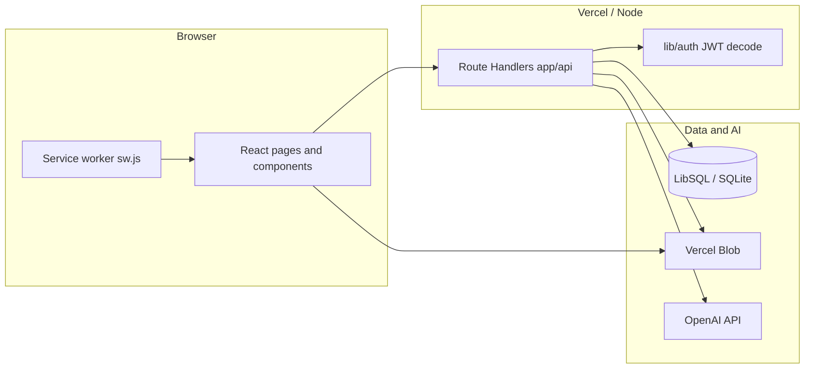
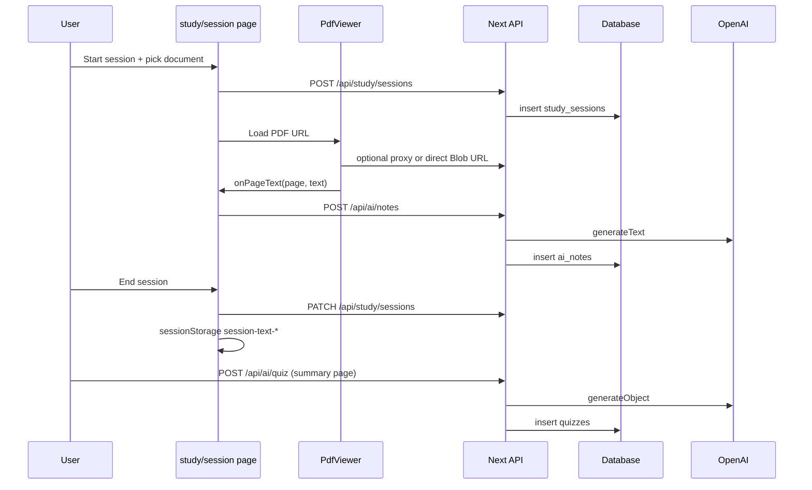

# Bowl Beacon — Architecture

This document describes the **Bowl Beacon** codebase: layout, APIs, frontend, data layer, AI integration, and operational concerns. It is intended for onboarding and system design discussions.

---

## 1. System overview

Bowl Beacon is a **Next.js 14 (App Router)** study app. Users authenticate with email/password, upload or select PDFs (including a textbook catalog), run **focused study sessions** with timers and anti-distraction UX, and optionally use **OpenAI-powered** notes, quizzes, and video suggestions. Files are stored on **Vercel Blob**; metadata and auth live in **SQLite-compatible** storage via **LibSQL** (e.g. Turso in production, local file in dev).



---

## 2. Technology stack

| Layer | Technology |
|--------|------------|
| Framework | Next.js 14, App Router, React 18 |
| Language | TypeScript |
| Styling | Tailwind CSS 3, `app/globals.css` |
| Auth | NextAuth v4, Credentials provider, JWT sessions |
| ORM | Drizzle ORM 0.36 |
| Database | `@libsql/client` — `DATABASE_URL` (file or Turso), optional `DATABASE_AUTH_TOKEN` |
| AI | Vercel AI SDK (`ai`), `@ai-sdk/openai`, Zod schemas |
| PDF | `react-pdf` + pdf.js (worker from unpkg) |
| Storage | `@vercel/blob` (upload, multipart, client tokens) |
| Compression | `fflate` (ZIP import on drive) |

**Build / config**

- `next.config.mjs`: exposes `NEXT_PUBLIC_APP_VERSION` from `package.json`; webpack ignores `canvas`; `serverActions.bodySizeLimit` 10mb.
- `drizzle.config.ts`: Drizzle Kit for migrations / push.
- `tsconfig.json`: path alias `@/*` → project root.

---

## 3. Repository file structure

High-level map (only meaningful directories and notable files).

```
/
├── app/                          # Next.js App Router
│   ├── layout.tsx                # Root layout: theme script, service worker registration
│   ├── page.tsx                  # Marketing / landing (PWA install hints)
│   ├── globals.css
│   ├── manifest.ts               # Web app manifest
│   ├── icon-192/route.tsx        # Dynamic icon routes
│   ├── icon-512/route.tsx
│   ├── auth/
│   │   ├── signin/page.tsx
│   │   └── signup/page.tsx
│   ├── dashboard/
│   │   ├── page.tsx              # User dashboard (documents, bookmarks, etc.)
│   │   └── PageViewerModal.tsx   # Modal PDF viewer for bookmarks
│   ├── study/
│   │   ├── session/page.tsx      # Main live study session UI
│   │   ├── session/[id]/summary/page.tsx  # Post-session stats, notes, quiz, review
│   │   └── history/page.tsx
│   ├── settings/page.tsx
│   ├── admin/page.tsx            # Admin console (guarded)
│   └── api/                      # Route handlers (see §5)
├── components/
│   ├── study/                    # Timer, PDF, picker, AI notes, quiz, review
│   └── focus/                    # Visibility, fullscreen, override / exit password
├── lib/
│   ├── auth.ts                   # NextAuth options + auth() JWT-from-cookie
│   ├── ai.ts                     # OpenAI client, model id, isAiConfigured()
│   ├── db/
│   │   ├── index.ts              # Drizzle db singleton
│   │   ├── schema.ts             # All table definitions
│   │   └── seed-textbooks.ts
│   ├── admin.ts                  # requireAdmin(), isAdmin() (Node)
│   ├── admin-edge.ts             # Admin check for Edge routes
│   ├── password.ts               # Password hashing / verification
│   ├── prefs.ts                  # User prefs (e.g. PDF zoom)
│   ├── themes.ts                 # Theme tokens
│   ├── music.ts                  # Study playlist helpers (YouTube / audio)
│   └── store.ts                  # Client-side store utilities if used
├── types/
│   └── next-auth.d.ts            # Session / JWT type extensions
├── public/                       # Static assets, sw.js, icons
├── scripts/
│   ├── migrate-blobs-public.mjs  # One-off: re-upload private blobs as public
│   └── bump-version.mjs
├── docs/
│   └── ARCHITECTURE.md           # This file
├── package.json
├── next.config.mjs
├── tailwind.config.ts
├── postcss.config.mjs
├── drizzle.config.ts
├── .env.example                  # Documented env vars (no secrets)
└── README.md                     # Quick setup and scripts
```

---

## 4. Data model (`lib/db/schema.ts`)

Drizzle **SQLite** tables (conceptual grouping):

**Authentication (NextAuth-compatible)**

- `users` — credentials, profile, goals, `exit_password_hash`, admin/mute/blocked flags.
- `accounts`, `auth_sessions`, `verification_tokens` — OAuth/session tables if extended.
- `banned_emails` — signup/signin blocklist.

**Study core**

- `study_sessions` — goal type/value, start/end, focused minutes, pages, `document_json` (resume), `videos_json` (cached AI video recs).
- `documents` — per-user PDFs: `file_url` (Blob), `source_type`, optional catalog link, `extracted_text`.
- `textbook_catalog` — shared books: `source_url`, chapter page ranges JSON, visibility flags.
- `session_content` — links session to document and chapter/page range.

**Engagement**

- `page_visits` — time on page per study session.
- `bookmarks` — bookmarks and highlights (type, color, tag, optional `session_id`).

**Productivity**

- `messages` — user-to-user messages.
- `study_plans` — weekly schedule slots.
- `exam_countdowns` — exams + optional page progress.

**AI persistence**

- `ai_notes` — generated notes per `session_id` + `page_number` + `content`.
- `quizzes` — `questions_json`, `review_json`, optional `score` / `total_questions`.

**Connection** (`lib/db/index.ts`): `drizzle` with `url` from `DATABASE_URL` (default `file:./study.db`) and optional `DATABASE_AUTH_TOKEN` for remote LibSQL.

---

## 5. HTTP APIs (`app/api/**/route.ts`)

All paths are relative to `/api`. Unless noted, handlers use **`auth()`** from `lib/auth.ts` (JWT from cookie `sf.session-token`). Admin routes use **`requireAdmin()`** or **`requireAdminEdge()`**.

### 5.1 Authentication

| Method | Path | Purpose |
|--------|------|---------|
| * | `/api/auth/[...nextauth]` | NextAuth catch-all (sign in/out, JWT). |
| POST | `/api/auth/signup` | Register user (validates banned list, hashes password). |
| POST | `/api/auth/verify-exit` | Verifies **exit password** against `users.exit_password_hash`. |

### 5.2 Study sessions and progress

| Method | Path | Purpose |
|--------|------|---------|
| GET | `/api/study/sessions` | List current user’s sessions (recent). |
| POST | `/api/study/sessions` | Start session; closes other open sessions for user; accepts `documentJson`. |
| PATCH | `/api/study/sessions` | Update session (progress, end, fields like `totalFocusedMinutes`, `endedAt`, etc.). |
| GET | `/api/study/sessions/[id]` | Single session for user. |
| GET | `/api/study/stats` | Aggregated stats, active session, settings used by session UI. |
| GET | `/api/study/chapters-read` | Chapter reading progress helper. |

### 5.3 Page visits

| Method | Path | Purpose |
|--------|------|---------|
| POST | `/api/page-visits` | Record page enter/leave events. |
| PATCH | `/api/page-visits` | Update visit (e.g. duration). |
| POST | `/api/page-visits/batch` | Batch flush from PDF viewer. |

### 5.4 Documents and textbooks

| Method | Path | Purpose |
|--------|------|---------|
| POST | `/api/documents/upload` | Form upload PDF → Blob → `documents` row. |
| POST | `/api/documents/register` | Register metadata after client upload completes. |
| GET | `/api/documents/[id]/file` | Redirect to stored `fileUrl` (Blob) if user owns doc. |
| GET | `/api/textbooks` | List/search catalog entries. |
| POST | `/api/textbooks` | Authenticated: re-seeds/updates `textbook_catalog` from `lib/db/seed-textbooks`. |

### 5.5 PDF proxy

| Method | Path | Purpose |
|--------|------|---------|
| GET, HEAD | `/api/proxy/pdf` | Authenticated proxy to **allowlisted** hosts (e.g. archive.org, openstax, vercel blob); supports **Range** for PDF.js streaming. |

### 5.6 User drive and settings

| Method | Path | Purpose |
|--------|------|---------|
| GET | `/api/user/drive` | List user’s drive documents. |
| DELETE | `/api/user/drive` | Remove drive entry / document per body. |
| POST | `/api/user/drive/import` | Import PDF from URL or ZIP (streams to Blob). |
| POST | `/api/user/drive/link` | Link external URL as document. |
| GET | `/api/user/settings` | User preferences. |
| PATCH | `/api/user/settings` | Update preferences. |

### 5.7 Bookmarks

| Method | Path | Purpose |
|--------|------|---------|
| GET | `/api/bookmarks` | Query by `documentId` / `sessionId`. |
| POST | `/api/bookmarks` | Create bookmark or highlight. |
| PATCH | `/api/bookmarks` | Update entry. |
| DELETE | `/api/bookmarks` | Delete by id. |
| GET | `/api/bookmarks/all` | All bookmarks for dashboard. |

### 5.8 Planner and countdowns

| Method | Path | Purpose |
|--------|------|---------|
| GET, POST, DELETE | `/api/planner` | Study plan CRUD. |
| GET, POST, PATCH, DELETE | `/api/countdowns` | Exam countdown CRUD. |

### 5.9 Messaging

| Method | Path | Purpose |
|--------|------|---------|
| GET, POST | `/api/messages` | Inbox / send (query params and body per implementation). |

### 5.10 Music

| Method | Path | Purpose |
|--------|------|---------|
| GET | `/api/music/search` | Search helper for study music (query-based). |

### 5.11 Vercel Blob (user and internal uploads)

| Method | Path | Runtime / notes |
|--------|------|-------------------|
| POST | `/api/blob/upload` | Server upload helper. |
| POST | `/api/blob/upload-direct` | Stream body to Blob + insert `documents`. |
| POST | `/api/blob/stream-upload` | **Edge** — JWT from cookie for auth; multipart stream. |
| POST | `/api/blob/multipart` | Multipart completion / parts. |
| POST | `/api/blob/token` | Legacy or internal token issuance. |
| POST | `/api/blob/client-token` | Token for **client-side** `@vercel/blob/client` uploads. |
| GET, HEAD | `/api/blob/serve` | Serve or probe blob access (implementation-specific). |
| GET | `/api/blob/health` | Health check. |

### 5.12 Admin APIs

All require admin session (Node: `requireAdmin`, Edge: `requireAdminEdge`). Super-admin / `isAdmin` logic lives in **`lib/admin.ts`** (see code for email + `users.isAdmin`).

| Method | Path | Purpose |
|--------|------|---------|
| GET | `/api/admin/users` | List users. |
| PATCH | `/api/admin/users` | Bulk or field updates. |
| GET, PATCH, DELETE | `/api/admin/users/[id]` | User detail, update, delete. |
| GET | `/api/admin/users/[id]/sessions/[sessionId]` | Inspect session. |
| GET, POST, PATCH, DELETE | `/api/admin/catalog` | Textbook catalog CRUD. |
| GET, DELETE | `/api/admin/blobs` | List / delete blobs. |
| GET | `/api/admin/blob-lookup` | Resolve blob metadata. |
| GET | `/api/admin/blob-token` | Token for admin uploads. |
| POST | `/api/admin/blob-token` | Create upload URL / token. |
| GET | `/api/admin/blob-client-token` | Client token for admin UI. |
| GET | `/api/admin/blob-write-token` | Write token exposure (guarded). |
| POST | `/api/admin/blob-stream` | **Edge** stream upload to Blob. |
| POST | `/api/admin/download-store` | Fetch remote PDF → Blob (catalog/archive flows). |
| GET | `/api/admin/archive-token` | Archive.org S3 signing helper. |
| POST | `/api/admin/archive-upload` | Upload to Archive. |
| POST | `/api/admin/mute-block` | Moderation. |
| GET, POST, DELETE | `/api/admin/banned-emails` | Ban list. |

---

## 6. AI architecture

### 6.1 Configuration (`lib/ai.ts`)

- **`OPENAI_API_KEY`**: required for AI routes; absence yields **503** from APIs.
- **`openai`**: `createOpenAI` from `@ai-sdk/openai`.
- **`MODEL`**: default `gpt-4o-mini` (change here to swap models).
- **`isAiConfigured()`**: boolean guard.

### 6.2 Routes

| Path | Methods | SDK call | Persistence |
|------|---------|----------|-------------|
| `/api/ai/notes` | POST, GET | `generateText` | `ai_notes` table |
| `/api/ai/quiz` | POST, GET | `generateObject` + Zod `quizSchema` | `quizzes` table |
| `/api/ai/videos` | GET, POST | `generateObject` + Zod `videoSchema` | `study_sessions.videos_json` |

**Notes (POST)**  
Body: `sessionId`, `pageNumber`, `pageText`. System prompt: concise study notes, bullets, `**bold**` terms, cap ~300 words; user content truncated (~6000 chars). Inserts row and returns `{ id, pageNumber, content }`.

**Notes (GET)**  
Query: `sessionId`. Returns notes for that session if owned by user.

**Quiz (POST)**  
Body: `sessionId`, `accumulatedText`. Loads existing AI notes for session as extra context. Generates MCQs (4 options, `correctIndex`), plus `review` object (`keyConcepts`, `thingsToReview`, `videoSuggestions` with YouTube-oriented search queries). Saves to `quizzes`.

**Quiz (GET)**  
Loads saved quiz + review + score for session.

**Videos (GET)**  
Returns cached `videosJson` from session or `{ videos: null }`.

**Videos (POST)**  
If not cached, runs `generateObject` on truncated reading text; writes `videosJson` on `study_sessions`.

### 6.3 Frontend integration

- **`components/study/AiNotesPanel.tsx`**: calls `POST /api/ai/notes` using `pageTexts` Map filled by **`PdfViewer`** (`getTextContent` per page).
- **`app/study/session/[id]/summary/page.tsx`**: loads notes/quiz via GET; triggers `POST /api/ai/quiz` with text from **`sessionStorage`** key `session-text-${sessionId}` (written in **`app/study/session/page.tsx`** when ending session). Video recommendations: `GET`/`POST /api/ai/videos` with same stored text pattern.

### 6.4 Dependencies

- `ai` — `generateText`, `generateObject`.
- `zod` — structured outputs for quiz and videos.

---

## 7. Frontend architecture

### 7.1 Routing (App Router)

| Route | Role |
|-------|------|
| `/` | Landing, install prompts, nav to auth. |
| `/auth/signin`, `/auth/signup` | Credentials auth. |
| `/dashboard` | Document library, bookmarks, open PDF modal. |
| `/study/session` | Live session: picker, timer, PDF, music, AI notes panel, focus UX. |
| `/study/session/[id]/summary` | Overview, notes tab, quiz tab, review tab, video suggestions. |
| `/study/history` | Past sessions list. |
| `/settings` | User settings. |
| `/admin` | Admin dashboard (server/client components per file). |

### 7.2 Key components

**Study (`components/study/`)**

- **`Timer.tsx`** — `goalType` time vs chapter; `setInterval` tick; `onTick` / `onGoalReached`.
- **`DocumentPicker.tsx`** — Modes: My Drive, upload (multipart Blob client), textbook catalog; PDF.js outline parsing for chapter ranges; yields `SelectedDocument`.
- **`PdfViewer.tsx`** — `react-pdf` document; zoom, search, TOC, bookmarks/highlights, page visit batching, `onPageText` for AI; loads bookmarks from API.
- **`AiNotesPanel.tsx`** — Triggers note generation per page or batch.
- **`QuizView.tsx`** — Steps through questions, score, `onComplete`.
- **`ReviewPanel.tsx`** — Renders post-quiz review + YouTube search links.

**Focus (`components/focus/`)**

- **`VisibilityGuard.tsx`** — `visibilitychange` → overlay when returning from hidden tab; parent pauses timer.
- **`OverrideFlow.tsx`** — “I need to stop” → exit password modal; optional fullscreen lock + `fullscreenchange` trap.
- **`FullscreenTrigger.tsx`** — Toggle `requestFullscreen` on `documentElement`.

**Dashboard**

- **`PageViewerModal.tsx`** — Simplified PDF view for a bookmark item; highlight support.

### 7.3 Client-only and dynamic imports

- **`app/study/session/page.tsx`** dynamically imports `PdfViewer` and `DocumentPicker` with `ssr: false` to avoid pdf.js on server.

### 7.4 PWA

- **`public/sw.js`** — Service worker (caching/update strategy as implemented in file).
- **`app/layout.tsx`** registers SW; **`app/manifest.ts`** defines installability.

---

## 8. Security and auth notes

- **Sessions**: JWT in httpOnly cookie (`sf.session-token`). **`auth()`** decodes JWT with `NEXTAUTH_SECRET` (avoids some `getServerSession` proxy issues).
- **API routes**: Typically `auth()` first; return **401** if missing user.
- **Admin**: `requireAdmin` checks super-admin email constant and/or `users.isAdmin` — see **`lib/admin.ts`**.
- **PDF proxy**: Host allowlist only — arbitrary URLs cannot be fetched.
- **Exit flow**: Stopping a locked session requires **`/api/auth/verify-exit`**.
- **Secrets**: Never commit `.env.local`; use `.env.example` as template.

---

## 9. Scripts and operations

| Script | Purpose |
|--------|---------|
| `npm run dev` | Next dev server. |
| `npm run build` / `start` | Production. |
| `npm run db:push` | Drizzle push schema to DB. |
| `npm run db:generate` / `db:migrate` | Migrations. |
| `scripts/migrate-blobs-public.mjs` | Migrates private Blob URLs in `textbook_catalog` to public (reads `.env.local` locally). |
| `scripts/bump-version.mjs` | Version bump helper. |

---

## 10. Environment variables (reference)

See **`.env.example`** for the canonical list. Typical production setup includes:

- `NEXTAUTH_SECRET`, `NEXTAUTH_URL`
- `DATABASE_URL`, optional `DATABASE_AUTH_TOKEN`
- `OPENAI_API_KEY` (AI features)
- `BLOB_READ_WRITE_TOKEN` (uploads / Blob)
- Archive keys for admin Archive upload features

---

## 11. Diagram: study session data flow



---

*Document generated to match repository layout and routes as of the `docs/ARCHITECTURE.md` authoring date. If you add routes or tables, update §4–§6 accordingly.*
