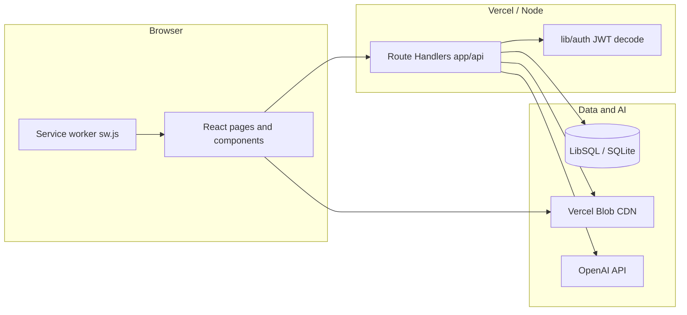
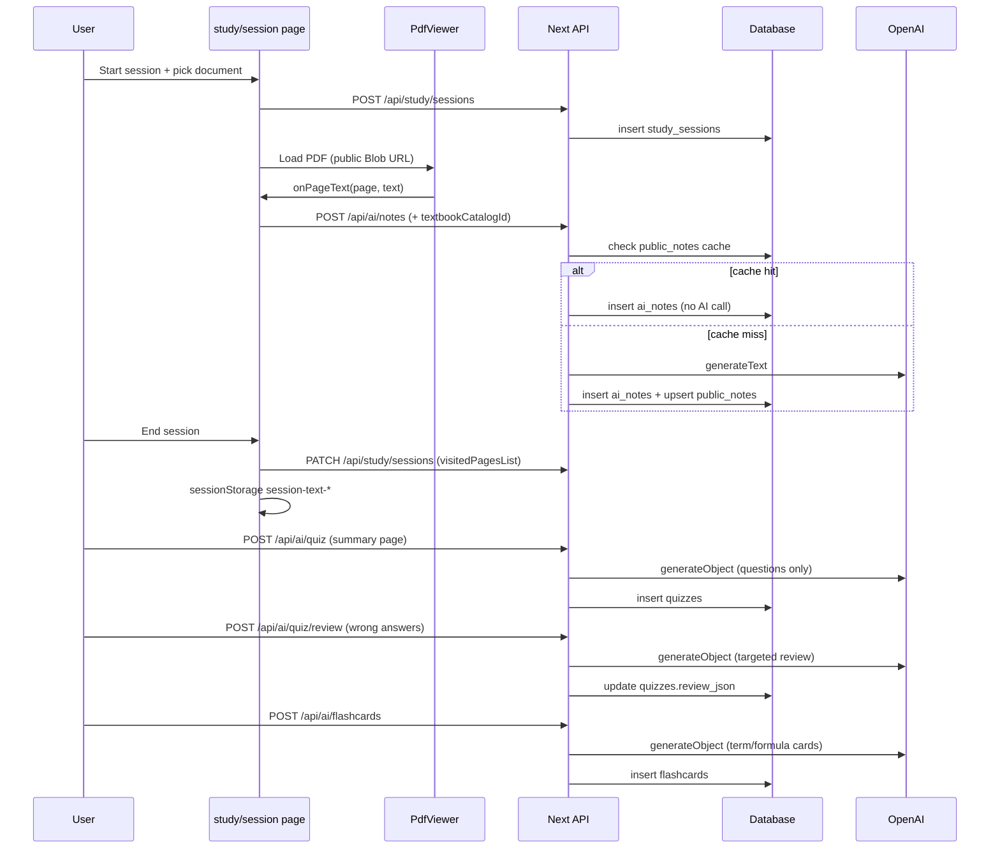

# Bowl Beacon — Architecture

This document describes the **Bowl Beacon** codebase: layout, APIs, frontend, data layer, AI integration, and operational concerns. It is intended for onboarding and system design discussions.

---

## 1. System overview

Bowl Beacon is a **Next.js 14 (App Router)** study app. Users authenticate with email/password, upload or select PDFs (including a textbook catalog), run **focused study sessions** with timers and anti-distraction UX, and optionally use **OpenAI-powered** notes, quizzes, video suggestions, and flashcards. Files are stored on **Vercel Blob** (public CDN); metadata and auth live in **SQLite-compatible** storage via **LibSQL** (Turso in production, local file in dev).



---

## 2. Technology stack

| Layer | Technology |
|--------|------------|
| Framework | Next.js 14, App Router, React 18 |
| Language | TypeScript |
| Styling | Tailwind CSS 3, `app/globals.css` |
| Auth | NextAuth v4, Credentials provider, JWT sessions |
| ORM | Drizzle ORM 0.36 |
| Database | `@libsql/client` — `DATABASE_URL` (file or Turso), optional `DATABASE_AUTH_TOKEN` |
| AI | Vercel AI SDK (`ai`), `@ai-sdk/openai`, Zod schemas |
| PDF | `react-pdf` + pdf.js (worker from unpkg) |
| Storage | `@vercel/blob` — all uploads use `access: "public"` for CDN delivery |
| Compression | `fflate` (ZIP import on drive) |

**Build / config**

- `next.config.mjs`: exposes `NEXT_PUBLIC_APP_VERSION` from `package.json`; webpack ignores `canvas`; `serverActions.bodySizeLimit` 10mb.
- `drizzle.config.ts`: Drizzle Kit for migrations / push.
- `tsconfig.json`: path alias `@/*` → project root.

---

## 3. Repository file structure

High-level map (only meaningful directories and notable files).

```
/
├── app/                          # Next.js App Router
│   ├── layout.tsx                # Root layout: theme script, service worker registration
│   ├── page.tsx                  # Marketing / landing (PWA install hints)
│   ├── globals.css
│   ├── manifest.ts               # Web app manifest
│   ├── icon-192/route.tsx        # Dynamic icon routes
│   ├── icon-512/route.tsx
│   ├── auth/
│   │   ├── signin/page.tsx
│   │   └── signup/page.tsx
│   ├── dashboard/
│   │   ├── page.tsx              # Dashboard: stats, streak card, textbook progress, bookmarks, etc.
│   │   └── PageViewerModal.tsx   # Modal PDF viewer for bookmarks
│   ├── study/
│   │   ├── session/page.tsx      # Main live study session UI
│   │   ├── session/[id]/summary/page.tsx  # Post-session: stats, notes, quiz, review, flashcards
│   │   └── history/page.tsx
│   ├── settings/page.tsx
│   ├── admin/page.tsx            # Admin console (guarded)
│   └── api/                      # Route handlers (see §5)
├── components/
│   ├── study/                    # Timer, PDF, picker, AI notes, quiz, review, flashcards
│   └── focus/                    # Visibility, fullscreen, override / exit password
├── lib/
│   ├── auth.ts                   # NextAuth options + auth() JWT-from-cookie
│   ├── ai.ts                     # OpenAI client, MODEL id ("gpt-5.4"), isAiConfigured()
│   ├── ai-notes-render.ts        # stripLatexForAiNotes(), aiNoteContentToHtml()
│   ├── app-settings.ts           # getAiOwnerStyleExtra(), appendOwnerStyleToSystem()
│   ├── admin.ts                  # requireAdmin(), requireSuperOwner() (Node)
│   ├── admin-edge.ts             # Admin check for Edge routes
│   ├── db/
│   │   ├── index.ts              # Drizzle db singleton
│   │   ├── schema.ts             # All table definitions
│   │   └── seed-textbooks.ts
│   ├── password.ts               # Password hashing / verification
│   ├── prefs.ts                  # User prefs (e.g. PDF zoom)
│   ├── themes.ts                 # Theme tokens
│   ├── music.ts                  # Study playlist helpers
│   └── store.ts                  # Client-side store utilities
├── types/
│   └── next-auth.d.ts            # Session / JWT type extensions
├── public/                       # Static assets, sw.js, icons
├── scripts/
│   ├── migrate-blobs-public.mjs  # One-off: re-upload private blobs as public
│   └── bump-version.mjs
├── docs/
│   └── ARCHITECTURE.md           # This file
├── package.json
├── next.config.mjs
├── tailwind.config.ts
├── postcss.config.mjs
├── drizzle.config.ts
├── .env.example                  # Documented env vars (no secrets)
└── README.md                     # Quick setup and scripts
```

---

## 4. Data model (`lib/db/schema.ts`)

Drizzle **SQLite** tables (conceptual grouping):

**Authentication (NextAuth-compatible)**

- `users` — credentials, profile, goals, `exit_password_hash`, admin/mute/blocked flags, `quiz_min_questions`, `quiz_max_questions`, `storage_bytes` (running upload total), `storage_quota_bytes` (null = 350 MB default).
- `accounts`, `auth_sessions`, `verification_tokens` — OAuth/session tables if extended.
- `banned_emails` — signup/signin blocklist.

**Study core**

- `study_sessions` — goal type/value, start/end, focused minutes, `pages_visited` (count), `visited_pages_list` (JSON `number[]` of unique page indices for dedup), `document_json` (resume), `videos_json` (cached AI video recs).
- `documents` — per-user PDFs: `file_url` (Blob), `source_type`, optional catalog link, `extracted_text`, `chapter_page_ranges` (user-defined TOC JSON), `page_offset` (PDF page alignment), `file_size_bytes` (used for quota tracking).
- `textbook_catalog` — shared books: `source_url`, `cached_blob_url` (single global public Blob copy; populated on first access), chapter page ranges JSON, visibility flags.
- `session_content` — links session to document and chapter/page range.

**Engagement**

- `page_visits` — time on page per study session.
- `bookmarks` — bookmarks and highlights (type, color, tag, optional `session_id`).

**Productivity**

- `messages` — user-to-user messages.
- `study_plans` — weekly schedule slots.
- `exam_countdowns` — exams + optional page progress.

**AI persistence**

- `ai_notes` — generated notes per `session_id` + `page_number` + `content`.
- `public_notes` — shared notes cache per `textbook_catalog_id` + `page_number` + `prompt_version`. Cache hit = zero AI tokens for subsequent users on same page. Bump `PUBLIC_NOTE_PROMPT_VERSION` in `app/api/ai/notes/route.ts` to invalidate on prompt change.
- `quizzes` — `questions_json`, `review_json`, optional `score` / `total_questions`.
- `flashcards` — `session_id`, `front`, `back`, `page_number`; cascades on session delete.

**Pomodoro / user preferences**

- `users` table now includes `pomodoro_enabled`, `pomodoro_focus_min`, `pomodoro_break_min`, `pomodoro_long_break_min`, `pomodoro_cycles` for per-user Pomodoro configuration saved to the DB.

**App config**

- `app_settings` — key/value store for owner-configurable settings (e.g. AI note style extra).

**Operations**

- `client_error_logs` — unified log with `kind`: **`user`** (browser errors via `POST /api/debug/client-error`) or **`dev`** (owner feature-debug via `POST /api/debug/dev-log`). Super-owner reads both via `GET /api/admin/debug-logs` (`userLogs` + `devLogs`); joins `users` for display name when `user_id` is set.

**Connection** (`lib/db/index.ts`): `drizzle` with `url` from `DATABASE_URL` (default `file:./study.db`) and optional `DATABASE_AUTH_TOKEN` for remote LibSQL.

---

## 5. HTTP APIs (`app/api/**/route.ts`)

All paths are relative to `/api`. User-scoped handlers use **`getAppUser()`** from `lib/app-user.ts` (JWT from `sf.session-token`, plus optional admin **view-as** cookie `sf.view-as-user`). **`auth()`** is kept where the real JWT identity must be used (`/api/admin/**` except data routes that intentionally act as another user, `/api/user/session-context`, `/api/admin/impersonate`). Admin routes use **`requireAdmin()`** or **`requireAdminEdge()`**.

### 5.1 Authentication

| Method | Path | Purpose |
|--------|------|---------|
| * | `/api/auth/[...nextauth]` | NextAuth catch-all (sign in/out, JWT). |
| POST | `/api/auth/signup` | Register user (validates banned list, hashes password). |
| POST | `/api/auth/verify-exit` | Verifies **exit password** against `users.exit_password_hash`. |

### 5.1b Debugging and impersonation

| Method | Path | Purpose |
|--------|------|---------|
| POST | `/api/debug/client-error` | Stores `kind: user` (optional session; anonymous allowed). |
| POST | `/api/debug/dev-log` | **Super-owner only:** append `kind: dev` for feature work (`lib/dev-debug.ts` → `reportDevDebug`). |
| GET | `/api/admin/debug-logs` | **Super-owner only:** `{ userLogs, devLogs }` from `client_error_logs` (joined names). |
| POST | `/api/admin/impersonate` | Admin: set or clear `sf.view-as-user` cookie (`{ userId: string \| null }`). |
| GET | `/api/user/session-context` | Returns JWT user vs effective user, whether impersonation is active, and **`isSuperOwner`** (real JWT email) for owner-only client diagnostics that must ignore view-as. |
| GET | `/api/app/settings-ui` | Public JSON: `{ version, elements }` — global Settings page copy/typography overrides stored in `app_settings` (`settings_ui_json`). |
| GET | `/api/admin/settings-ui` | **Admin:** same payload as `/api/app/settings-ui`. |
| PUT | `/api/admin/settings-ui` | **Admin:** replace `{ version, elements }` for app-wide Settings UI strings/styles. |

### 5.2 Study sessions and progress

| Method | Path | Purpose |
|--------|------|---------|
| GET | `/api/study/sessions` | List current user's sessions (recent). |
| POST | `/api/study/sessions` | Start session; closes other open sessions for user; accepts `documentJson`. |
| PATCH | `/api/study/sessions` | Update session fields: `totalFocusedMinutes`, `endedAt`, `pagesVisited`, `visitedPagesList`, etc. |
| GET | `/api/study/sessions/[id]` | Single session for user. |
| GET | `/api/study/stats` | Aggregated stats (streak, weekly chart, goals), active session info. |
| GET | `/api/study/chapters-read` | Chapter reading progress helper. |

### 5.3 Page visits

| Method | Path | Purpose |
|--------|------|---------|
| POST | `/api/page-visits` | Record page enter/leave events. |
| PATCH | `/api/page-visits` | Update visit (e.g. duration). |
| POST | `/api/page-visits/batch` | Batch flush from PDF viewer. |

### 5.4 Documents and textbooks

| Method | Path | Purpose |
|--------|------|---------|
| POST | `/api/documents/upload` | Form upload PDF → Blob (public) → `documents` row. |
| POST | `/api/documents/register` | Register metadata after client upload completes. |
| GET, PATCH | `/api/documents/[id]` | Get metadata or update `chapterPageRanges` / `pageOffset` / `title` for a document; owner or admin only. |
| POST | `/api/documents/ensure-imported` | Returns the URL to use for a catalog PDF. Returns `cachedBlobUrl` from the catalog row if one was previously stored; otherwise returns the authenticated proxy URL (`/api/proxy/pdf`). No blob uploads — catalog books are served via proxy with 30-day Vercel edge CDN caching. |
| GET | `/api/documents/[id]/file` | Redirect to stored `fileUrl` (Blob) if user owns doc. |
| GET | `/api/textbooks` | List/search catalog entries. |
| POST | `/api/textbooks` | Authenticated: re-seeds/updates `textbook_catalog` from `lib/db/seed-textbooks`. |

### 5.5 PDF proxy

| Method | Path | Purpose |
|--------|------|---------|
| GET, HEAD | `/api/proxy/pdf` | Authenticated proxy to **allowlisted** hosts; supports **Range** for PDF.js streaming. Sets `Cache-Control: public, max-age=604800, s-maxage=2592000` — Vercel edge CDN caches each byte range for 30 days, so Fast Origin Transfer only applies to the first request per edge region. |

### 5.6 User settings and drive

| Method | Path | Purpose |
|--------|------|---------|
| GET | `/api/user/drive` | List user's drive documents. |
| DELETE | `/api/user/drive` | Remove drive entry / document per body. |
| POST | `/api/user/drive/import` | Import PDF from URL or ZIP (streams to Blob). |
| POST | `/api/user/drive/link` | Link external URL as document. |
| GET | `/api/user/storage` | Returns `{ usedBytes, quotaBytes, pct, usedFormatted, quotaFormatted }` for the current user. |
| GET | `/api/user/settings` | User preferences (includes `quizMinQuestions`, `quizMaxQuestions`, Pomodoro config). |
| PATCH | `/api/user/settings` | Update preferences (validates 1–25 for quiz bounds; Pomodoro fields: focus 1–90 min, break 1–30 min, long break 1–60 min, cycles 1–10). |
| GET | `/api/user/textbook-progress` | Returns per-textbook stats: sessions, minutes, **unique** pages visited (union of `visitedPagesList` across sessions), progress %. |
| GET | `/api/user/heatmap` | Returns `{ days: { date, minutes }[] }` for the past 365 days for the GitHub-style activity heatmap on the dashboard. |

User-uploaded documents are accessible **only by the owner or an admin** — enforced in `GET/PATCH /api/documents/[id]` and `GET /api/user/drive`.

**Storage quota** (`lib/storage.ts`): default 350 MB per user. `register` checks `user.storageBytes + fileSize > quota` before inserting; returns HTTP 413 if exceeded. `drive DELETE` subtracts the size. Admin can set per-user `storageQuotaBytes` override via `PATCH /api/admin/users/[id]`.

### 5.7 Bookmarks

| Method | Path | Purpose |
|--------|------|---------|
| GET | `/api/bookmarks` | Query by `documentId` / `sessionId`. |
| POST | `/api/bookmarks` | Create bookmark or highlight. |
| PATCH | `/api/bookmarks` | Update entry. |
| DELETE | `/api/bookmarks` | Delete by id. |
| GET | `/api/bookmarks/all` | All bookmarks for dashboard. |

### 5.8 Planner and countdowns

| Method | Path | Purpose |
|--------|------|---------|
| GET, POST, DELETE | `/api/planner` | Study plan CRUD. |
| GET, POST, PATCH, DELETE | `/api/countdowns` | Exam countdown CRUD. |

### 5.9 Messaging

| Method | Path | Purpose |
|--------|------|---------|
| GET, POST | `/api/messages` | Inbox / send. |

### 5.10 Music

| Method | Path | Purpose |
|--------|------|---------|
| GET | `/api/music/search` | Search helper for study music. |

### 5.11 Vercel Blob (user and internal uploads)

All uploads use `access: "public"` so PDFs are served directly from the Vercel CDN, not proxied through Next.js serverless functions.

| Method | Path | Runtime / notes |
|--------|------|-------------------|
| POST | `/api/blob/upload` | Server upload helper. |
| POST | `/api/blob/upload-direct` | Stream body to Blob + insert `documents`. |
| POST | `/api/blob/stream-upload` | **Edge** — JWT from cookie for auth; multipart stream. |
| POST | `/api/blob/multipart` | Multipart completion / parts. |
| POST | `/api/blob/token` | Legacy or internal token issuance. |
| POST | `/api/blob/client-token` | Token for **client-side** `@vercel/blob/client` uploads. |
| GET, HEAD | `/api/blob/serve` | Serve or probe blob access. |
| GET | `/api/blob/health` | Health check (admin-only). |

### 5.12 Admin APIs

All require admin session. Super-admin / owner routes use `requireSuperOwner()` from `lib/admin.ts`.

| Method | Path | Purpose |
|--------|------|---------|
| GET | `/api/admin/users` | List users. |
| PATCH | `/api/admin/users` | Bulk or field updates. |
| GET, PATCH, DELETE | `/api/admin/users/[id]` | User detail, update, delete. |
| GET | `/api/admin/users/[id]/sessions/[sessionId]` | Inspect session. |
| GET | `/api/admin/catalog/cleanup-blobs` | Dry-run preview: reports how many rows/blobs would be deleted and estimated freed bytes. |
| POST | `/api/admin/catalog/cleanup-blobs` | Deletes all per-user catalog document blobs + rows and clears `cachedBlobUrl` from catalog rows. Recalculates `storageBytes` for affected users. |
| GET, DELETE | `/api/admin/blobs` | List / delete blobs. |
| GET | `/api/admin/blob-lookup` | Resolve blob metadata. |
| GET, POST | `/api/admin/blob-token` | Token for admin uploads (admin-only). |
| GET | `/api/admin/blob-client-token` | Client token for admin UI. |
| GET | `/api/admin/blob-write-token` | Write token exposure (guarded). |
| POST | `/api/admin/blob-stream` | **Edge** stream upload to Blob. |
| POST | `/api/admin/download-store` | Fetch remote PDF → Blob. |
| GET | `/api/admin/archive-token` | Returns `{ ok, configured }` — **never** raw Archive keys. |
| POST | `/api/admin/archive-upload` | Upload to Archive. |
| POST | `/api/admin/mute-block` | Moderation. |
| GET, POST, DELETE | `/api/admin/banned-emails` | Ban list. |
| GET | `/api/admin/debug-logs` | **Super-owner:** `userLogs` + `devLogs` (`limit` per list). |
| POST | `/api/admin/impersonate` | Set/clear admin **view-as** cookie. |
| GET, PATCH | `/api/admin/owner-ai` | Super-owner: get/set `noteStyleExtra` and active `MODEL`. |
| POST | `/api/admin/owner-ai/chat` | Super-owner: direct chat with OpenAI for debugging. |

---

## 6. AI architecture

### 6.1 Configuration (`lib/ai.ts`)

- **`OPENAI_API_KEY`**: required for AI routes; absence yields **503**.
- **`openai`**: `createOpenAI` from `@ai-sdk/openai`.
- **`MODEL`**: currently `"gpt-5.4"` — change here to swap globally.
- **`isAiConfigured()`**: boolean guard used by all AI routes.

### 6.2 Owner AI customisation (`lib/app-settings.ts`)

- **`getAiOwnerStyleExtra()`** / **`setAiOwnerStyleExtra()`**: reads/writes the `app_settings` row with key `"ai_note_style_extra"`.
- **`appendOwnerStyleToSystem(system, extra)`**: appends the owner's custom instructions to the base system prompt if non-empty.
- Accessible to the super-owner via the admin panel's **Owner AI** tab.

### 6.3 Routes

| Path | Methods | SDK call | Persistence |
|------|---------|----------|-------------|
| `/api/ai/notes` | POST, GET | `generateText` | `ai_notes` + `public_notes` cache |
| `/api/ai/quiz` | POST, GET | `generateObject` + Zod `quizSchema` | `quizzes` table |
| `/api/ai/quiz/review` | POST | `generateObject` | updates `quizzes.review_json` + `score` |
| `/api/ai/videos` | GET, POST | `generateObject` + Zod `videoSchema` | `study_sessions.videos_json` |
| `/api/ai/flashcards` | POST, GET | `generateObject` + Zod `flashcardSchema` | `flashcards` table |

**Notes (POST)**  
Body: `sessionId`, `pageNumber`, `pageText`, optional `textbookCatalogId`.  
If `textbookCatalogId` is provided, checks `public_notes` for a matching row at the current `PUBLIC_NOTE_PROMPT_VERSION`. Cache hit → returns cached content, no AI call. Cache miss → calls OpenAI, strips LaTeX via `stripLatexForAiNotes()`, saves to `ai_notes` and upserts into `public_notes` for future users. Bump `PUBLIC_NOTE_PROMPT_VERSION` in the route whenever the system prompt changes.

**Notes (GET)**  
Query: `sessionId`. Returns all notes for the session sorted by page number.

**Quiz (POST)**  
Body: `sessionId`, `accumulatedText`. Reads `quizMinQuestions` / `quizMaxQuestions` from user settings (default 3–10, max 25). Question count = `pagesRead × 1.5` clamped to user range. Shuffles answer options (Fisher-Yates) so the correct answer is not always index 0. Saves questions only (no review) to `quizzes`.

**Quiz Review (POST)**  
Body: `quizId`, `score`, `totalQuestions`, `wrongQuestions`. If score is perfect, returns `{ perfect: true }` and updates score — no AI call. Otherwise calls OpenAI to generate `thingsToReview` and `videoSuggestions` targeted at the specific wrong answers. Updates `quizzes.review_json`.

**Quiz (GET)**  
Returns saved quiz + review + score for the session.

**Videos (GET/POST)**  
GET returns cached `videosJson`. POST generates and caches if not present.

**Flashcards (POST)**  
Body: `sessionId`. Fetches all `ai_notes` for the session. Calls `generateObject` to produce term/formula reference cards (~3 per page note). **Front** = term or concept name (never a question). **Back** = plain-language definition/explanation + formula in plain text. Inserts into `flashcards`, returns card array.

**Flashcards (GET)**  
Query: `sessionId`. Returns existing cards sorted by page number.

### 6.4 Frontend integration

- **`components/study/AiNotesPanel.tsx`**: calls `POST /api/ai/notes` per page (or batch). Accepts `textbookCatalogId` prop to enable public cache. Fetches existing notes from DB on mount to persist state across hide/show. Displays page numbers relative to the chapter start (`absolutePage - startPage + 1`).
- **`app/study/session/[id]/summary/page.tsx`**: tabs for Overview, Notes, Quiz, Review, and **Flashcards**. Loads notes/quiz/flashcards via GET on mount. Triggers POST endpoints on demand. After quiz completion calls `POST /api/ai/quiz/review` with wrong answers only.
- **`components/study/QuizView.tsx`**: tracks `wrongAnswers` state; passes them to `onComplete`.
- **`components/study/ReviewPanel.tsx`**: shows personalised review from wrong answers, or congratulations on a perfect score.
- **`components/study/FlashcardView.tsx`**: 3D CSS flip animation, previous/next navigation, card counter, shuffle button.

### 6.5 Dependencies

- `ai` — `generateText`, `generateObject`.
- `zod` — structured outputs for quiz, videos, flashcards.

---

## 7. Frontend architecture

### 7.1 Routing (App Router)

| Route | Role |
|-------|------|
| `/` | Landing, install prompts, nav to auth. |
| `/auth/signin`, `/auth/signup` | Credentials auth. |
| `/dashboard` | Stats, **streak card**, **textbook progress**, bookmarks, planner, countdowns. |
| `/study/session` | Live session: picker, timer, PDF, music, AI notes panel, focus UX. |
| `/study/session/[id]/summary` | Overview, Notes, Quiz, Review, **Flashcards** tabs. |
| `/study/history` | Past sessions list. |
| `/settings` | User settings (includes quiz question min/max). |
| `/admin` | Admin dashboard (guarded; **Settings UI** tab for global copy/typography; **Debug log** / **Owner AI** super-owner only). |

Global UI (`components/AppChrome.tsx`): **`ClientErrorReporter`** posts `window.onerror` / `unhandledrejection` to `/api/debug/client-error` (`kind: user`); **`ImpersonationBanner`** shows when an admin is viewing as another user (`GET /api/user/session-context`). Owner feature notes use **`reportDevDebug`** from `lib/dev-debug.ts` → `/api/debug/dev-log`.

### 7.2 Key components

**Study (`components/study/`)**

- **`Timer.tsx`** — `goalType` time vs chapter; `setInterval` tick; `onTick` / `onGoalReached`.
- **`DocumentPicker.tsx`** — Modes: My Drive, upload (multipart Blob client), textbook catalog; PDF.js outline parsing for chapter ranges; yields `SelectedDocument`. After upload completes, shows `UploadedDocEditor` — lets the user enter a per-chapter TOC (chapter label + PDF start/end page) and a page offset; saves to `PATCH /api/documents/[id]`; the chapter data is then available immediately in the session.
- **`PdfViewer.tsx`** — `react-pdf`; zoom, search, TOC, bookmarks/highlights, page visit batching, `onPageText` for AI.
- **`AiNotesPanel.tsx`** — Generates/displays notes per page; accepts `textbookCatalogId` for shared cache; page numbers shown relative to chapter start.
- **`QuizView.tsx`** — Steps through questions, tracks wrong answers, calls `onComplete(score, total, wrongAnswers)`.
- **`ReviewPanel.tsx`** — Targeted review for wrong answers; perfect-score congratulations view.
- **`FlashcardView.tsx`** — 3D flip cards; shuffle; previous/next navigation.

**Focus (`components/focus/`)**

- **`VisibilityGuard.tsx`** — `visibilitychange` → overlay; pauses timer.
- **`OverrideFlow.tsx`** — Exit password modal; optional fullscreen lock.
- **`FullscreenTrigger.tsx`** — Toggle `requestFullscreen`.

**Dashboard**

- **`PageViewerModal.tsx`** — Simplified PDF view for a bookmark item.

### 7.3 Dashboard features

- **Streak card**: shows current streak with flame icon; amber "at risk" warning if streak > 0 and no session today; green "going strong" if studied today.
- **Textbook progress**: fetches `GET /api/user/textbook-progress`; shows each catalog book with a progress bar derived from the **union** of all unique pages visited across sessions (not a sum, so re-reading a page doesn't inflate the count).
- **Weekly chart**: bar chart of daily study minutes; minimum bar height ensures small values are visible.

### 7.4 Page tracking (unique pages)

When the user navigates a PDF, `visitedPagesRef` (`Set<number>`) accumulates each unique page index. On every progress save and on session end the client sends both `pagesVisited` (count) and `visitedPagesList` (JSON array) to `PATCH /api/study/sessions`. The progress route unions these arrays across all sessions per textbook to compute the true unique page count.

### 7.5 Client-only and dynamic imports

- **`app/study/session/page.tsx`** dynamically imports `PdfViewer` and `DocumentPicker` with `ssr: false`.
- **`app/settings/page.tsx`** — Shows a scroll hint under the title for cards below the fold; **Daily goals** renders quiz min/max number inputs **above** the hint paragraph so admin `SuiText` typography on the hint cannot hide the fields.

### 7.6 PWA / Offline mode

- **`components/settings/SettingsUiProvider.tsx`** — Fetches `GET /api/app/settings-ui` and applies per-key text + inline styles on the Settings page via **`SuiText`**. Admins edit the same keys in **Developer Panel → Settings UI**: a scrollable preview lists **Daily goals** through **Keyboard shortcuts** (not only the first three cards); right-click text, **Apply globally** → `PUT /api/admin/settings-ui`.
- **`public/sw.js`** — Service worker (cache version bumps wipe old buckets) with three caching strategies:
  - **Cache-first**: `/api/proxy/pdf`, **`/api/blob/serve`** (private blob streams from `lib/client` URLs), and direct Vercel Blob PDF URLs — PDFs load from cache after first fetch; pdf.js uses many **Range** requests per file, so eviction and the “cached PDFs” counter use **distinct URLs** (one logical book), not raw Cache API entry counts. User uploads that load via **`GET /api/documents/[id]/file`** redirect to the stored blob URL; that follow-up request is cached under the blob-host rule when the file is served from a public `*.blob.vercel-storage.com` URL.
  - Turning **off** offline PDF cache in Settings runs `setPdfCacheEnabled: false` in the SW (which **`waitUntil`** deletes the PDF bucket) **and** `clearAllPdfCachesClient()` from the page so all `bowlbeacon-pdf-*` caches are removed on that device.
  - **Stale-while-revalidate**: `/api/auth/session`, `/api/study/stats`, `/api/textbooks`, `/api/user/drive`, `/api/user/settings`, `/api/user/textbook-progress`, `/api/study/sessions` — cached data shown immediately, updated in background.
  - **Network-first with fallback**: all app shell pages — always tries fresh, falls back to cache when offline.
- **`lib/offline-session.ts`** — Client-side offline session queue backed by `localStorage`. When the device is offline: `enqueueOfflineSession()` stores the session locally with a `offline-*` temp ID; `updateOfflineSession()` updates the progress snapshot; `syncOfflineSessions()` replays all queued sessions to the server (honoring the original `startedAt` time) and fires `offlineSessionSynced` events for UI updates.
- **`app/study/session/page.tsx`** — Offline-aware session page: detects `navigator.onLine`, shows an amber "You're offline" banner during the session, falls back to `enqueueOfflineSession()` if `POST /api/study/sessions` fails, queues `saveProgress` patches locally, marks session completed locally on end, then redirects to `/study/history` (full summary available after sync). AI Notes button is disabled during offline sessions. `syncOfflineSessions()` is called on mount and on every `online` event.
- **`POST /api/study/sessions`** — Accepts optional `startedAt` ISO string so synced offline sessions preserve their real start time.
- **`app/layout.tsx`** registers SW; **`app/manifest.ts`** defines installability.

---

## 8. Security and auth notes

- **Sessions**: JWT in httpOnly cookie (`sf.session-token`). **`auth()`** decodes JWT with `NEXTAUTH_SECRET`.
- **API routes**: user data routes use **`getAppUser()`** (JWT + optional admin view-as cookie); return **401** if missing user. **`auth()`** remains for admin authorization and impersonation endpoints.
- **Admin view-as**: httpOnly cookie `sf.view-as-user` (set by `POST /api/admin/impersonate`). Only **`isAdmin`** accounts may receive it; app routes resolve the target user’s data while `/api/admin/**` stays on the real JWT for permission checks.
- **Debug logs**: `GET /api/admin/debug-logs`, `POST /api/debug/dev-log` — **super-owner only** (`requireSuperOwner`). User browser errors still post anonymously or signed-in to `POST /api/debug/client-error` without admin access to read.
- **Admin**: `requireAdmin` checks `users.isAdmin`; `requireSuperOwner` checks hardcoded super-admin email.
- **PDF proxy**: host allowlist only — arbitrary URLs cannot be fetched.
- **Exit flow**: stopping a locked session normally requires `/api/auth/verify-exit`. **Offline-queued** sessions (`offline-*` id from `lib/offline-session.ts`) set `requireExitPassword={false}` on **`OverrideFlow`** so exit does not call the API when the network is unavailable.
- **Blob**: `/api/blob/health` and `/api/admin/blob-token` are admin-only; `/api/admin/archive-token` returns only `{ ok, configured }` — never raw keys.
- **Secrets**: never commit `.env.local`; `.env.production` and `*credentials*.json` are in `.gitignore`.

---

## 9. Scripts and operations

| Script | Purpose |
|--------|---------|
| `npm run dev` | Next dev server. |
| `npm run build` / `start` | Production. |
| `npm run db:push` | Drizzle push schema to DB. |
| `npm run db:generate` / `db:migrate` | Migrations. |
| `scripts/migrate-blobs-public.mjs` | Migrates private Blob URLs in `textbook_catalog` to public. |
| `scripts/bump-version.mjs` | Version bump helper (runs automatically on commit via git hook). |

---

## 10. Environment variables (reference)

See **`.env.example`** for the canonical list. Typical production setup:

- `NEXTAUTH_SECRET`, `NEXTAUTH_URL`
- `DATABASE_URL`, optional `DATABASE_AUTH_TOKEN`
- `OPENAI_API_KEY` (all AI features)
- `BLOB_READ_WRITE_TOKEN` (uploads / Blob)
- Archive keys for admin Archive upload features

---

## 11. Diagram: study session data flow



---

*Update §4–§6 and §11 whenever routes, tables, or AI flows change.*

---

## §12 – Settings Page Layout (hardcoded, state-aware)

### 12.1 Overview
The settings page has **4 hardcoded layouts**, one per combination of the two user toggles that change how much empty space there is on the page. No admin editor, no DB config, no runtime fetch — the layout is pure client code in `lib/types/settings-layout.ts`.

| State key             | PDF cache | Study breaks | What's in the right column |
|-----------------------|-----------|--------------|-----------------------------|
| `cacheOff_breaksOff`  | OFF       | OFF          | Textbook size → Upload storage → Dog → Credits |
| `cacheOff_breaksOn`   | OFF       | ON           | Upload storage → Session defaults → Dog → Credits |
| `cacheOn_breaksOff`   | ON        | OFF          | Study breaks → PDF cache → Exit password (no easter eggs) |
| `cacheOn_breaksOn`    | ON        | ON           | Study breaks → Textbook size → Upload storage → Credits |

At runtime `resolveLayoutStateKey(pdfCacheEnabled, pomodoroEnabled)` picks the active key; the settings page reads `LAYOUTS[key]` and renders the 4 regions:
- `top`    — full-width cards above the 2-column flow (Daily goals)
- `left`   — half-width cards in the left flex column (top-to-bottom)
- `right`  — half-width cards in the right flex column (top-to-bottom)
- `bottom` — full-width cards below the 2-column flow (Focus music, Theme, Keyboard shortcuts)

### 12.2 Types (`lib/types/settings-layout.ts`)
```ts
export type LayoutStateKey = "cacheOff_breaksOff" | "cacheOff_breaksOn" | "cacheOn_breaksOff" | "cacheOn_breaksOn";
export interface LayoutSpec { top: string[]; left: string[]; right: string[]; bottom: string[]; }
export const LAYOUTS: Record<LayoutStateKey, LayoutSpec>;
export function resolveLayoutStateKey(pdfCacheEnabled: boolean, pomodoroEnabled: boolean): LayoutStateKey;
```
No `CardConfig`, `SettingsLayoutConfig`, `mergeWithDefaults`, or admin-editor types exist — the previous config-driven layout was scrapped because the CSS-columns masonry approach couldn't place specific cards in specific columns reliably.

### 12.3 Settings Page Rendering (`app/settings/page.tsx`)
1. `activeStateKey = resolveLayoutStateKey(pdfCacheEnabled, pomodoroEnabled)` recomputes on every render; toggling either setting re-positions cards live without a page reload.
2. A local `cardSectionMap: Record<string, ReactNode>` defines every section once.
3. A `renderRegion(ids)` helper maps a list of IDs from `LAYOUTS[key]` to its JSX.
4. The render tree is:
   ```
   <div>
     {renderRegion(spec.top)}
     <div className="md:grid md:grid-cols-2 md:gap-4">
       <div className="flex flex-col gap-4">{renderRegion(spec.left)}</div>
       <div className="flex flex-col gap-4">{renderRegion(spec.right)}</div>
     </div>
     {renderRegion(spec.bottom)}
   </div>
   ```
5. Stub helpers (`ctitle`, `cdesc`, `titleClass`, `descClass`, `cardStyle`, `cardGridCol`) are kept so the existing section JSX continues to compile — they all return the default values now that config-driven overrides have been removed.

### 12.4 Deprecated (not removed)
- `global_config` table in `lib/db/schema.ts` is still defined but **unused**. It was the storage backing for the scrapped admin editor. Left in place to avoid a destructive schema migration; can be dropped safely any time.
- No API route at `/api/admin/settings-layout` exists any more.
- No `SettingsLayoutTab` admin tab exists any more.
