# Bowl Beacon — Complete Codebase Guide

This is the **full walkthrough** of Bowl Beacon for readers new to code. Read it cover-to-cover (or jump by feature) and you should understand what the app does, how every major screen works, which files and functions are involved, and why each tool was chosen.

**You do not need to open the source code to understand the app.** Part 2 explains behavior, call chains, and key functions in plain English. Open files only when you are changing code or debugging a specific edge case.

**Companion doc:** [`ARCHITECTURE.md`](ARCHITECTURE.md) holds raw endpoint/schema tables for column-level lookup. Use it alongside this guide, not instead of it.

**How to use this guide:**

1. **Part 0** — vocabulary and how web apps work (read once).
2. **Part 1** — every dependency and infrastructure choice (read once).
3. **Part 2** — Features 1–19: the entire product, one section per area.
4. **Part 3** — complete API route index (all 83 routes), page map, `lib/` + `components/` index, recipes.

Each feature section uses the same layout: what it does → key terms → diagram → files → call chain → functions → libraries → why.

---

## Part 0 — Read this first

### 0.1 Glossary (zero prior knowledge assumed)

| Term | Plain English | Analogy |
|------|---------------|---------|
| **Frontend** | Code that runs in the user's browser and draws the screen | The dining room of a restaurant — what guests see |
| **Backend** | Code that runs on a server, talks to the database, keeps secrets | The kitchen — guests don't go in, but everything important happens there |
| **React** | A library for building UI out of reusable pieces called **components** | LEGO bricks you snap together into pages |
| **Component** | One reusable UI block (a button, a card, a whole panel) | One LEGO brick or sub-assembly |
| **Next.js** | A framework built on React that adds routing, APIs, and deployment | React + "folders become URLs" + built-in server |
| **App Router** | Next.js's modern routing system: files under `app/` become pages | `app/dashboard/page.tsx` → visiting `/dashboard` shows that file |
| **`"use client"`** | A marker at the top of a file meaning "this code runs in the browser" | Needed for clicks, animations, `useState`, keyboard shortcuts |
| **Server Component** | A React component that runs only on the server (default in App Router) | Can read the database directly; no click handlers |
| **API route** | A server file that answers HTTP requests like `GET /api/review/queue` | The app's private phone line — the UI calls it with `fetch()` |
| **`fetch()`** | JavaScript's way to ask another URL for data | Browser: "Hey server, give me my flashcards" |
| **JSON** | A text format for structured data: `{ "name": "Jay", "cards": 30 }` | Like a labeled form the computer can read |
| **Database (DB)** | Long-term storage organized in **tables** (like spreadsheets) | Filing cabinet of spreadsheets |
| **Row** | One record in a table (one user, one session, one flashcard) | One row in a spreadsheet |
| **Column** | One field on a row (`email`, `due_at`, `front`) | One column header |
| **ORM (Drizzle)** | Code that reads/writes the database using TypeScript instead of raw SQL strings | Translator between your app and SQL |
| **JWT** | A signed token proving "this browser belongs to user X" | Wristband at a concert |
| **Session cookie** | A small file the browser stores and sends back on every request | The wristband stored in your pocket |
| **Environment variable** | Secret or config value outside the code (in Vercel or `.env.local`) | Settings in a locked drawer, not in the git repo |
| **Presigned URL** | A temporary link that lets the browser upload/download a file directly to cloud storage | A VIP pass valid for one hour |
| **302 redirect** | Server says "don't fetch from me — go to this other URL instead" | Receptionist pointing you to the right room |
| **LibSQL / Turso** | SQLite-compatible database that works in the cloud (Turso) or as a local file (dev) | One spreadsheet system that works locally and online |
| **R2** | Cloudflare's file storage (like a hard drive in the cloud) | Warehouse for PDFs |
| **Egress** | Data leaving a cloud provider's network (often billed per GB) | Shipping fee when files leave the warehouse |
| **PWA** | Progressive Web App — installable, can work offline with a service worker | App-like website you can add to your home screen |
| **Service worker (`sw.js`)** | A background script that caches files for offline use | Pantry that keeps copies of things you've already fetched |

---

### 0.2 How a web request flows through Bowl Beacon

When you open Bowl Beacon in Chrome:

1. Your browser asks **Vercel** for an HTML page (e.g. `/dashboard`).
2. Next.js runs server code, checks your **session cookie**, maybe reads the **database**.
3. The server sends back HTML + JavaScript bundles.
4. React "hydrates" the page in your browser — buttons become clickable.
5. When you click something (e.g. "Start review"), the browser calls an **API route** with `fetch()`.
6. The API route checks you're logged in, reads/writes the **database** or **R2**, returns JSON.
7. React updates the screen with the new data.

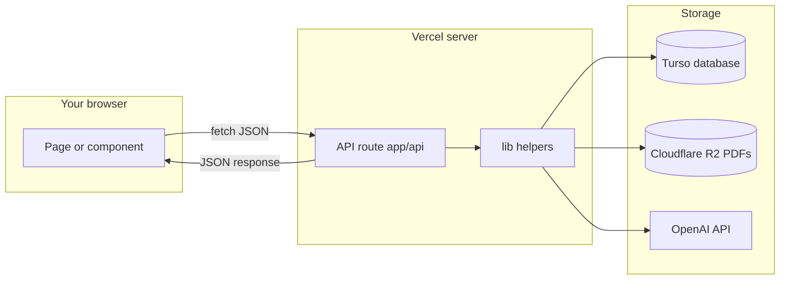

---

### 0.3 How this repo is organized (four layers)

Every feature touches some combination of these folders:

| Layer | Folder | What lives here |
|-------|--------|-----------------|
| **Pages** | `app/**/page.tsx` | Full screens: dashboard, study session, review, settings |
| **UI pieces** | `components/**` | Reusable blocks: timer, PDF viewer, flashcard flip |
| **APIs** | `app/api/**/route.ts` | Server endpoints the UI calls |
| **Shared logic** | `lib/**` | Auth, database, AI, storage, algorithms — used by APIs and sometimes pages |

**Rule of thumb:** UI never talks to the database directly. UI → API → `lib/` → database/storage.

---

### 0.4 What this guide already explains (you don't need the repo)

The sections below duplicate the most important ideas from heavily commented source files. **Read the feature sections first** — only open the linked files if you are editing that area.

| Topic | Explained in this guide | Source file (optional) |
|-------|-------------------------|-------------------------|
| Password hashing at sign-up | Feature 1 — `hashPassword`, `verifyPassword`, sign-in chain | [`lib/password.ts`](../lib/password.ts) |
| FSRS grades and scheduling | Feature 6 — `scheduleNext`, modes table, grade flow | [`lib/srs.ts`](../lib/srs.ts) |
| Review queue modes and filters | Feature 6 — `due` vs `all`/`new`/…, deck keys, caps | [`app/api/review/queue/route.ts`](../app/api/review/queue/route.ts) |
| Study session progress | Feature 3 — timer, pause, PATCH flow | [`app/study/session/page.tsx`](../app/study/session/page.tsx) |
| AI generation pipeline | Feature 5 — per-route table, fact-check | [`app/api/ai/`](../app/api/ai/) |

**Passwords (Feature 1 summary):** Sign-up hashes with random salt + slow `scrypt`; stored as `salt:hash`. Login re-derives and compares with `timingSafeEqual` so attackers can't guess from response timing.

**SRS (Feature 6 summary):** Grades are 1–4 (Again → Easy). Only [`lib/srs.ts`](../lib/srs.ts) imports `ts-fsrs` so the algorithm can be swapped later. First **Good** on a new card schedules ~10 minutes (Learning) before multi-day Review intervals — that is intentional, not a bug.

**Review queue (Feature 6 summary):** `mode=due` respects daily new/review caps from Settings. Explicit modes (`all`, `new`, `learning`, `mature`) ignore caps. `decks=tc:…,d:…` filters by textbook or document. `maxAgeDays` limits card age. Server hard-caps at 1000 cards per request.

### 0.5 Optional — when you open source code to edit or debug

The repo also has inline comments for developers. If you open a file, read in this order:

1. **File-top block** (`/** ... */` at line 1) — what the whole file is for.
2. **Section headers** — e.g. `// ── GET: list sessions ──` split long files into chunks.
3. **Function comments** — why a decision was made, not just what the next line does.

**Find usages:** In Cursor, `Cmd+Shift+F` (Mac) or `Ctrl+Shift+F` (Windows) to search a function name across the repo.

---

## Part 1 — Dependencies and why we chose each tool

### 1.1 Every package in `package.json` (production)

These are **libraries** — pre-written code we import instead of building from scratch.

| Package | What it is | What Bowl Beacon uses it for | Without it |
|---------|------------|------------------------------|------------|
| `next` | The Next.js framework | Routing, API routes, builds, deployment | No app framework |
| `react`, `react-dom` | UI library | Every screen and component | No user interface |
| `next-auth` | Authentication library | Login sessions, JWT cookies | No sign-in |
| `@libsql/client` | Database driver | Connects to Turso/local SQLite | No database access |
| `drizzle-orm` | ORM (database helper) | Typed queries, schema definitions | Raw SQL everywhere |
| `ai` | Vercel AI SDK | `generateText`, `generateObject`, streaming | Manual OpenAI HTTP calls |
| `@ai-sdk/openai` | OpenAI provider for AI SDK | Routes AI calls to OpenAI | No AI provider hookup |
| `zod` | Schema validator | Defines shapes for AI output (quiz questions, flashcards) | AI returns unpredictable JSON |
| `@aws-sdk/client-s3` | Amazon S3 API client | Talks to Cloudflare R2 (S3-compatible) | No R2 upload/download |
| `@aws-sdk/lib-storage` | Multipart upload helper | Large PDF uploads in chunks | Big uploads fail |
| `@aws-sdk/s3-request-presigner` | Signed URL generator | Presigned GET/PUT for R2 | Browser can't access R2 directly |
| `react-pdf` | PDF renderer for React | Shows PDFs in the study session | No in-app PDF reading |
| `unpdf` | PDF text extraction (server) | Admin TOC auto-extract from PDFs | No server-side PDF text |
| `ts-fsrs` | FSRS spaced repetition algorithm | Schedules when flashcards are due | No smart review timing |
| `fflate` | ZIP compression library | User drive ZIP import | No bulk import |
| `@dnd-kit/core`, `sortable`, `utilities` | Drag-and-drop | Admin UI reordering | Manual ordering only |

**Dev dependencies** (only needed while building, not in production runtime):

| Package | Purpose |
|---------|---------|
| `typescript` | Type checking — catches mistakes before deploy |
| `tailwindcss`, `postcss`, `autoprefixer` | CSS styling system |
| `drizzle-kit` | Database migration/push tooling |
| `eslint`, `eslint-config-next` | Code style and bug linting |

---

### 1.2 Major infrastructure choices (and alternatives)

#### Hosting: Vercel + Next.js

**Why we use it:** One git push deploys both the website and all API routes. Next.js App Router matches how the app is structured (`app/dashboard`, `app/api/review/queue`). Vercel's Node runtime runs AI calls, database access, and presigned URL generation.

**Alternatives considered:**

| Option | Pros | Why we didn't pick it (for now) |
|--------|------|----------------------------------|
| Plain React + separate Express API | Full control | Two deployments, more wiring, more ops |
| Railway / Render | Flexible | More manual server management |
| Cloudflare Pages only | Cheap, fast static | API routes and AI fit Vercel Node better today |

---

#### Database: Turso (LibSQL / SQLite)

**Why we use it:** Study data is relational (users → sessions → flashcards → documents). SQLite syntax is simple. Turso adds a hosted LibSQL endpoint so production doesn't need a always-on Postgres server. Drizzle ORM gives TypeScript types on every query.

**Alternatives considered:**

| Option | Pros | Why we didn't pick it (for now) |
|--------|------|----------------------------------|
| Postgres (Neon, Supabase) | Stronger at huge scale, richer SQL | Heavier ops; current scale doesn't need it |
| Firebase Firestore | Real-time, easy mobile | Different data model; harder relational queries |
| Supabase (DB + auth) | Auth + DB in one | Auth already on NextAuth; migration cost |

**Trade-off:** Some SRS queue logic uses raw SQL (`db.$client.execute`) because complex joins are clearer in SQL than Drizzle's query builder.

---

#### PDF storage: Cloudflare R2

**Why we use it:** PDFs are large and users re-read them constantly. R2 has **no egress fees** (you don't pay per GB downloaded). The browser uploads and downloads **directly** to R2 using presigned URLs, so PDF bytes never stream through Vercel — avoiding "Fast Origin Transfer" billing.

**What we used before:** Vercel Blob — simpler SDK but ~1 GB free tier and bytes proxied through Vercel.

**Alternatives compared:**

| Option | Pros | Cons for Bowl Beacon |
|--------|------|----------------------|
| **Cloudflare R2** (chosen) | No egress, S3 API, direct browser access | Separate Cloudflare account setup |
| **AWS S3** | Industry standard | Egress costs add up for PDF streaming |
| **Vercel Blob** | Easiest with Vercel | Small free tier; bytes through Vercel |
| **Supabase Storage** | Good if on Supabase | We're not on Supabase |
| **Google Cloud Storage** | Reliable | Similar egress cost concerns |

**Conclusion:** R2 is the best fit for "many large PDFs, heavy re-reading." See [`r2-update.md`](r2-update.md) for the migration runbook.

---

#### Authentication: NextAuth (email/password)

**Why we use it:** Already integrated. JWT sessions in httpOnly cookies. No per-user auth vendor bill. Full control over the `users` table (goals, admin flags, AI token limits).

**Alternatives considered:**

| Option | Pros | Why deferred |
|--------|------|--------------|
| **Clerk** | Polished auth UI, scales well | Migration cost + pricing; user asked to do later |
| **Supabase Auth** | Tight with Supabase DB | Would couple auth + DB migration together |
| **Auth0** | Enterprise features | Overkill for current scale |

**Trade-off:** We maintain password hashing ([`lib/password.ts`](../lib/password.ts)), ban list, and admin checks ourselves.

---

#### AI: Vercel AI SDK + OpenAI

**Why we use it:** `generateObject()` returns structured JSON validated by **Zod** schemas — critical for quizzes and flashcards. Token usage is tracked in [`lib/ai-usage.ts`](../lib/ai-usage.ts) for per-user budgets.

**Alternatives:**

| Option | Pros | Cons |
|--------|------|------|
| Raw OpenAI HTTP API | No extra dependency | More boilerplate, no Zod integration |
| Anthropic only | Strong reasoning | Would split provider logic |
| Local models | No API cost | Can't run on Vercel serverless realistically |

---

#### Spaced repetition: `ts-fsrs` (FSRS-4.5)

**Why we use it:** Modern algorithm (successor to SM-2). Wrapped in [`lib/srs.ts`](../lib/srs.ts) so only one file imports `ts-fsrs` — swappable later.

**Alternatives:**

| Option | Pros | Cons |
|--------|------|------|
| **FSRS** (chosen) | Better retention modeling | Slightly more complex |
| **SM-2** (Anki classic) | Simple, well understood | Weaker scheduling |
| **Custom scheduler** | Full control | Easy to get wrong |

---

### 1.3 Environment variables (plain English)

See `.env.example` for the full list. Never commit real secrets to git.

| Variable | What it controls | Sensitive? |
|----------|------------------|------------|
| `NEXTAUTH_SECRET` | Signs session JWTs — if leaked, attackers could forge logins | Yes |
| `NEXTAUTH_URL` | Canonical app URL for auth callbacks | No |
| `DATABASE_URL` | Where the database lives (`file:./study.db` or Turso URL) | Yes (if remote) |
| `DATABASE_AUTH_TOKEN` | Turso auth token | Yes |
| `OPENAI_API_KEY` | Powers all AI features | Yes |
| `AI_TOKEN_LIMIT_DEFAULT` | Default AI token cap per user (`0` = unlimited) | No |
| `R2_ACCOUNT_ID`, `R2_ACCESS_KEY_ID`, `R2_SECRET_ACCESS_KEY` | Cloudflare R2 credentials | Yes |
| `R2_BUCKET`, `R2_ENDPOINT` | Which R2 bucket and API endpoint | Partially |
| `R2_PUBLIC_BASE_URL` / `NEXT_PUBLIC_R2_PUBLIC_BASE_URL` | Public URL for shared textbooks | No |
| `YOUTUBE_API_KEY` | Resolves video recommendations to real YouTube URLs | Yes |

---

## Part 2 — Feature deep-dives

Each section below follows the same template:

1. What it does  
2. Key terms  
3. Flow diagram  
4. Files involved  
5. Step-by-step call chain  
6. Important functions defined  
7. Libraries used  
8. Why we built it this way  

### Feature index (all 19)

| # | Feature | Primary URL / entry |
|---|---------|---------------------|
| 1 | Auth (sign up, sign in, impersonation) | `/auth/signin`, `lib/auth.ts` |
| 2 | Database schema | `lib/db/schema.ts` |
| 3 | Study session (timer, PDF, focus tools) | `/study/session` |
| 4 | PDF upload & R2 storage | `lib/storage-backend.ts` |
| 5 | AI (notes, quiz, flashcards, velocity, videos) | `/api/ai/*` |
| 6 | Spaced repetition review | `/review` |
| 7 | Dashboard homepage | `/dashboard` |
| 8 | Admin panel | `/admin` |
| 9 | PWA, offline, PDF cache | `public/sw.js` |
| 10 | Settings | `/settings` |
| 11 | Post-session summary | `/study/session/[id]/summary` |
| 12 | Bookmarks & page visits | `PdfViewer`, `/api/bookmarks` |
| 13 | User drive & documents | `DocumentPicker` |
| 14 | Study history | `/study/history` |
| 15 | Landing page & global chrome | `/`, `AppChrome` |
| 16 | Cumulative study goals | `study_goals` table |
| 17 | Study music playlist | Settings + session page |
| 18 | Planner, countdowns, activity calendar | Dashboard widgets |
| 19 | Message Developer chat | Dashboard modal |

---

## Feature 1 — Sign up, sign in, and "who am I?"

### What this feature does

Users create an account with email + password, sign in, and get a session cookie. Every protected page and API checks that cookie. Admins can optionally "view as" another user for debugging.

### Key terms (this feature)

- **Credentials provider** — NextAuth mode where we check email/password ourselves (not Google login).
- **authorize** — The function that runs at login: lookup user, verify password.
- **httpOnly cookie** — Browser sends it automatically; JavaScript can't read it (safer against theft).

### Flow diagram

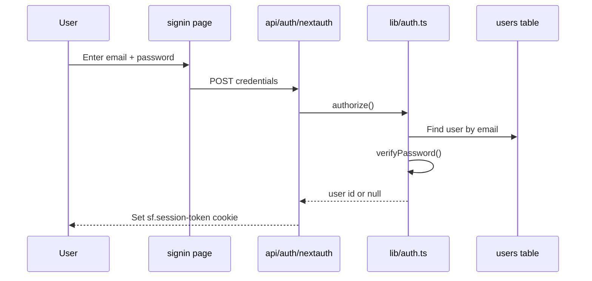

### Files involved

| File | Role |
|------|------|
| [`app/auth/signin/page.tsx`](../app/auth/signin/page.tsx) | Sign-in form UI |
| [`app/auth/signup/page.tsx`](../app/auth/signup/page.tsx) | Sign-up form UI |
| [`app/api/auth/signup/route.ts`](../app/api/auth/signup/route.ts) | Creates new user row |
| [`app/api/auth/[...nextauth]/route.ts`](../app/api/auth/[...nextauth]/route.ts) | NextAuth entry point |
| [`lib/auth.ts`](../lib/auth.ts) | Auth config + `auth()` helper |
| [`lib/password.ts`](../lib/password.ts) | Hash and verify passwords |
| [`lib/app-user.ts`](../lib/app-user.ts) | `getAppUser()` for API routes |
| [`lib/admin.ts`](../lib/admin.ts) | `isAdmin()`, `requireAdmin()` |
| [`app/page.tsx`](../app/page.tsx) | Redirects logged-in users to `/dashboard` |

### Step-by-step call chain

1. User submits sign-in form → browser POSTs to NextAuth.
2. NextAuth calls `authorize()` in [`lib/auth.ts`](../lib/auth.ts).
3. `authorize` checks `banned_emails`, finds `users` row, calls `verifyPassword()`.
4. On success, NextAuth creates a JWT and sets cookie `sf.session-token`.
5. Later, any API route calls `getAppUser()` → `auth()` decodes JWT from cookie.
6. If no valid session → API returns **401 Unauthorized**.

### Sign-up call chain (separate from sign-in)

1. User fills form on [`app/auth/signup/page.tsx`](../app/auth/signup/page.tsx).
2. Browser `POST /api/auth/signup` with `{ email, password, name }`.
3. Route checks banned list, duplicate email, password length ≥ 6.
4. `hashPassword()` → insert new row in `users` with `crypto.randomUUID()` id.
5. User is redirected to sign-in (account exists but no auto-login in v1).

### Exit password (end session gate)

1. During study, user clicks **End Session** → [`ExitGateFlow.tsx`](../components/focus/ExitGateFlow.tsx).
2. If Boss Beacons enabled: 20s cooldown → up to 3 MC boss fights from visited pages → optional typed phrase fallback.
3. Session PATCH includes `exitMethod` (`boss_cleared`, `phrase_fallback`, `gate_off`, etc.).
4. On success, session ends and user leaves the study flow.

### Important functions

#### `authorize(credentials)` — `lib/auth.ts` (inside `authOptions`)

**What:** Checks email/password at login time.  
**Inputs:** `{ email, password }` from the form.  
**Returns:** `{ id, email, name }` if valid, or `null` if wrong/banned.  
**Called by:** NextAuth automatically on sign-in.  
**Calls:** `db.query.users.findFirst`, `verifyPassword()`.

#### `auth()` — `lib/auth.ts`

**What:** Reads the session cookie and decodes the JWT to get the current user.  
**Returns:** `{ user: { id, email, name } }` or `null`.  
**Called by:** Server pages, `getAppUser()`, some API routes.  
**Calls:** `cookies()`, `decode()` from `next-auth/jwt`.

#### `getAppUser()` — `lib/app-user.ts`

**What:** The "who is this request for?" helper used by almost every user API.  
**Returns:** `{ id, email, name }` or `null`.  
**Called by:** `/api/review/*`, `/api/study/*`, `/api/user/*`, etc.  
**Calls:** `auth()`, and if admin has impersonation cookie `sf.view-as-user`, may return the impersonated user instead.

#### `hashPassword(password)` — `lib/password.ts`

**What:** Turns a plain password into a stored `salt:hash` string.  
**Returns:** String safe to save in `users.password_hash`.  
**Called by:** Sign-up route, password change in settings.  
**Uses library:** Node `crypto` `scrypt` (slow hash — good for security).

#### `verifyPassword(password, stored)` — `lib/password.ts`

**What:** Checks a login password against the stored hash.  
**Returns:** `true` or `false`.  
**Called by:** `authorize()` at login, exit-password checks.  
**Uses:** `timingSafeEqual` to prevent timing attacks.

#### `isAdmin(email)` — `lib/admin.ts`

**What:** Returns whether an email is an admin (hardcoded super-owner or DB flag).  
**Returns:** boolean.  
**Called by:** `getAppUser()`, admin routes, developer panel gate.

### Libraries used

- `next-auth` — session management  
- `drizzle-orm` + `@libsql/client` — user lookup  
- Node `crypto` — password hashing  

### Why we built it this way

- JWT in httpOnly cookie avoids server-side session table lookups on every request.
- `getAppUser()` separate from `auth()` lets admin impersonation work without breaking admin authorization.
- Custom credentials auth keeps all user data in our `users` table (goals, quotas, flags in one place).

---

## Feature 2 — Database: where everything is stored

### What this feature does

All persistent data lives in a SQLite-compatible database (local file in dev, Turso in production). Table definitions live in one schema file; the app accesses them through Drizzle ORM.

### Key terms

- **Schema** — The blueprint of all tables and columns.
- **Migration** — A change to the schema (add column, new table).
- **Foreign key** — Link between tables (e.g. `flashcards.session_id` → `study_sessions.id`).

### Flow diagram

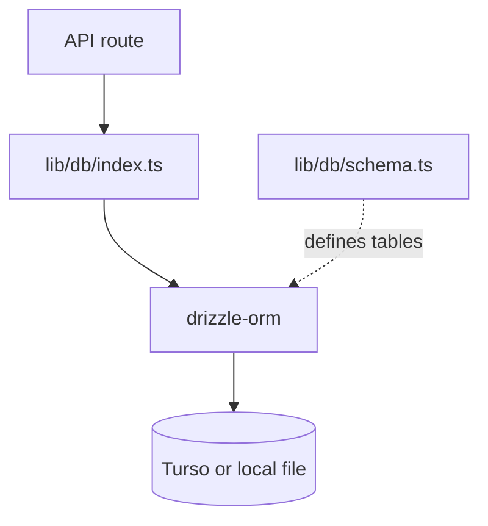

### Files involved

| File | Role |
|------|------|
| [`lib/db/schema.ts`](../lib/db/schema.ts) | All table/column definitions |
| [`lib/db/index.ts`](../lib/db/index.ts) | Creates `db` connection singleton |
| [`drizzle.config.ts`](../drizzle.config.ts) | Drizzle Kit config for `db:push` |
| [`scripts/apply-srs-schema.mjs`](../scripts/apply-srs-schema.mjs) | One-shot column adds for SRS |

### Step-by-step: reading data

1. API route imports `db` from [`lib/db/index.ts`](../lib/db/index.ts).
2. Route runs e.g. `db.query.users.findFirst({ where: ... })`.
3. Drizzle translates that to SQL and sends it to LibSQL.
4. Turso (or local file) returns rows as JavaScript objects.

### Important functions / patterns

#### `db` — `lib/db/index.ts`

**What:** The single database connection used everywhere.  
**Created with:** `drizzle({ connection: { url, authToken }, schema })`.  
**Used by:** Every API route and auth helper that touches data.

#### `db.query.<table>.findFirst(...)` — pattern

**What:** Drizzle's way to read one row.  
**Example:** `db.query.users.findFirst({ where: (u, { eq }) => eq(u.email, email) })`.  
**Returns:** One row object or `undefined`.

#### `db.$client.execute({ sql, args })` — pattern

**What:** Escape hatch for raw SQL when joins are too complex for Drizzle.  
**Used by:** [`app/api/review/queue/route.ts`](../app/api/review/queue/route.ts) for SRS queue building.

### Core tables (plain English)

| Table | Stores |
|-------|--------|
| `users` | Accounts, goals, admin flags, AI token usage, SRS daily caps |
| `study_sessions` | Each study or review sitting: timer, pages, start/end |
| `study_goals` | Multi-session cumulative time targets |
| `documents` | User-uploaded PDFs: title, R2 URL, TOC, page offset |
| `textbook_catalog` | Shared textbooks available to all users |
| `session_content` | Links a session to a document + chapter range |
| `page_visits` | Time spent per page (wall clock + focused seconds) |
| `flashcards` | AI-generated cards + FSRS scheduling columns |
| `quizzes` | Generated quiz questions and scores |
| `messages` | User ↔ developer chat messages |
| `bookmarks` | Saved pages and highlights |
| `study_plans` | Weekly planner blocks (day, start/end time, optional textbook) |
| `exam_countdowns` | Named exam dates for dashboard countdown widgets |
| `ai_notes` | Cached per-page AI notes keyed by session + page |
| `velocity_games` | Completed velocity game results per session |
| `velocity_question_bank` | Reusable velocity question pairs (admin catalog) |
| `ai_usage_logs` | Per-call AI token audit trail |
| `client_error_logs` | Browser JS errors reported by `ClientErrorReporter` |
| `app_settings` | Key/value store for Owner AI prompts and global config |
| `public_notes` / `document_notes` | Admin-curated notes attached to catalog docs |
| `document_quiz_questions` | Admin-curated quiz items for catalog docs |
| `global_config` | Misc app-wide flags |
| `banned_emails` | Sign-up/login block list |
| `accounts` / `auth_sessions` / `verification_tokens` | NextAuth adapter tables (mostly unused with JWT strategy) |

Full column list: [`ARCHITECTURE.md` §4](ARCHITECTURE.md#4-data-model-libdbschemats).

### Libraries used

- `@libsql/client` — wire protocol to database  
- `drizzle-orm` — typed queries  

### Why we built it this way

- One schema file = single source of truth for data shape.
- SQLite-compatible = simple local dev (`file:./study.db`) matches production (Turso).
- Raw SQL escape hatch for SRS without fighting the ORM.

---

## Feature 3 — Study session (core product)

### What this feature does

The main study experience: pick a PDF, set a timer goal, read with focus tools (pause on tab switch, fullscreen, Boss Beacons exit gate), track pages and time, then land on a summary with AI tools.

### Key terms

- **Goal type `time`** — Countdown timer for N minutes.
- **Goal type `chapter`** — Read specific chapter page range.
- **Focused minutes** — Time the timer was actually running (not paused).
- **Pause & leave** — Session stays open as `paused`; user can resume later.

### Flow diagram

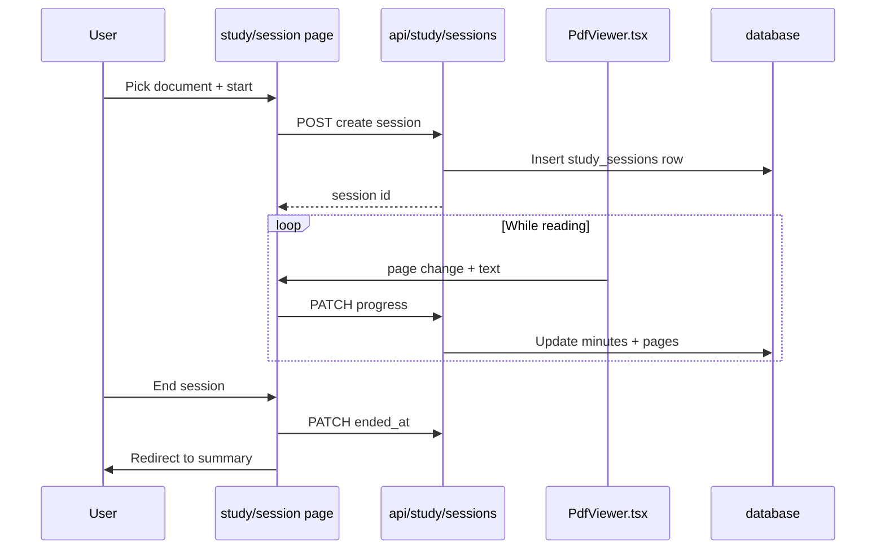

### Files involved

| File | Role |
|------|------|
| [`app/study/session/page.tsx`](../app/study/session/page.tsx) | Main orchestrator (~1700 lines) |
| [`components/study/DocumentPicker.tsx`](../components/study/DocumentPicker.tsx) | Choose/upload PDF |
| [`components/study/Timer.tsx`](../components/study/Timer.tsx) | Countdown/count-up timer |
| [`components/study/PdfViewer.tsx`](../components/study/PdfViewer.tsx) | PDF display, page tracking |
| [`components/study/AiNotesPanel.tsx`](../components/study/AiNotesPanel.tsx) | Per-page AI notes |
| [`components/focus/VisibilityGuard.tsx`](../components/focus/VisibilityGuard.tsx) | Pause when tab hidden |
| [`components/focus/ExitGateFlow.tsx`](../components/focus/ExitGateFlow.tsx) | End session + Boss Beacons gate |
| [`app/api/study/sessions/route.ts`](../app/api/study/sessions/route.ts) | Create/list/update sessions |
| [`app/study/session/[id]/summary/page.tsx`](../app/study/session/[id]/summary/page.tsx) | Post-session hub |

### Step-by-step call chain (new session)

1. User opens `/study/session` → `DocumentPicker` shows drive/catalog/upload.
2. User picks document and goal → page calls `POST /api/study/sessions`.
3. API inserts `study_sessions` row, returns `id`.
4. `PdfViewer` loads PDF via `pdfClientLoadUrl(file_url)`.
5. `Timer` ticks every second; parent `saveProgress` PATCHes every minute (and on page change).
6. `VisibilityGuard` sets `isPaused` when user switches tabs.
7. User clicks **End Session** → `ExitGateFlow` runs Boss Beacons (if enabled) → PATCH session `ended_at` + `exit_method` → redirect to `/study/session/[id]/summary`.

### Important functions

#### `saveProgress(minutes)` — `app/study/session/page.tsx`

**What:** Sends current timer minutes, page index, and visited-pages list to the server.  
**Called by:** Timer tick handler, page change handler.  
**Calls:** `PATCH /api/study/sessions` (or offline queue if no network).

#### `StudySessionInner` — `app/study/session/page.tsx`

**What:** The main component holding all session state (`sessionId`, `isPaused`, document, timer).  
**Uses:** `useState`, `useCallback`, `useEffect`, dynamic imports for PDF picker/viewer.

#### `Timer` callbacks — `components/study/Timer.tsx`

**What:** `onTick(elapsed)` fires each second; `onGoalReached()` when countdown hits zero.  
**Inputs:** `goalType`, `targetValue`, optional `initialElapsedSeconds` for resume.

#### `PdfViewer` page visit batching — `components/study/PdfViewer.tsx`

**What:** Records when user enters/leaves each PDF page; computes `focused_seconds` vs wall clock.  
**Calls:** Parent callbacks → eventually `page_visits` rows via session progress API.

#### `maybeCompleteStudyGoal(goalId, userId)` — `app/api/study/sessions/route.ts`

**What:** After a session ends, sums focused minutes across linked sessions; marks cumulative goal completed if target met.  
**Called by:** PATCH handler when session ends.

#### `sessionIsLive(state)` — `app/api/study/sessions/route.ts`

**What:** Returns true unless `session_state` is `paused`. Used to enforce "one live session" rules.

### Focus tools (anti-distraction)

| Component | File | Behavior |
|-----------|------|----------|
| `VisibilityGuard` | `components/focus/VisibilityGuard.tsx` | Listens to `document.visibilitychange`; when tab hidden, calls `onPause()` so timer stops |
| `FullscreenTrigger` | `components/focus/FullscreenTrigger.tsx` | Optional fullscreen mode for reading |
| `ExitGateFlow` | `components/focus/ExitGateFlow.tsx` | End-session Boss Beacons gate |
| `PomodoroTimer` | `components/study/PomodoroTimer.tsx` | Focus/break cycles when `pomodoroEnabled` in settings |

**Call chain:** tab hidden → `VisibilityGuard` → parent sets `isPaused=true` → `Timer` stops ticking → `saveProgress` still runs on resume/page change but focused minutes only count while unpaused.

### Resume and multi-session goals

- **Resume:** Dashboard banner links to `/study/session?resume=<id>`; page loads existing session row and restores timer elapsed seconds.
- **Multi-session goal:** User can start a session linked to `study_goals` via `continueStudyGoalId` POST field; see Feature 16.

### Libraries used

- `react-pdf` — PDF rendering  
- `next/dynamic` — load PDF components client-only (`ssr: false`)  
- Drizzle — session rows  

### Why we built it this way

- One large orchestrator page keeps session state in one place (trade-off: file is long — use search).
- Dynamic import of PDF avoids server-side rendering issues with pdf.js.
- `focused_seconds` separate from wall clock enables honest "time actually studying" metrics.

---

## Feature 4 — PDF upload, storage, and viewing (R2)

### What this feature does

PDFs live in Cloudflare R2. Uploads go browser → R2 directly. Viewing goes browser → R2 (via public URL or short-lived presigned URL). Vercel only checks permissions and issues redirects.

### Key terms

- **Object key** — File path inside the bucket, e.g. `public/campbell-biology/...pdf` or `userId/docId.pdf`.
- **Single PUT** — One HTTP request uploads entire file (smaller files).
- **Multipart upload** — Large files split into parts (over 50 MB).
- **Public key** — Under `public/` prefix; anyone with URL can read (textbooks).
- **Private key** — Under `<userId>/`; needs presigned URL or auth gate.

### Flow diagram

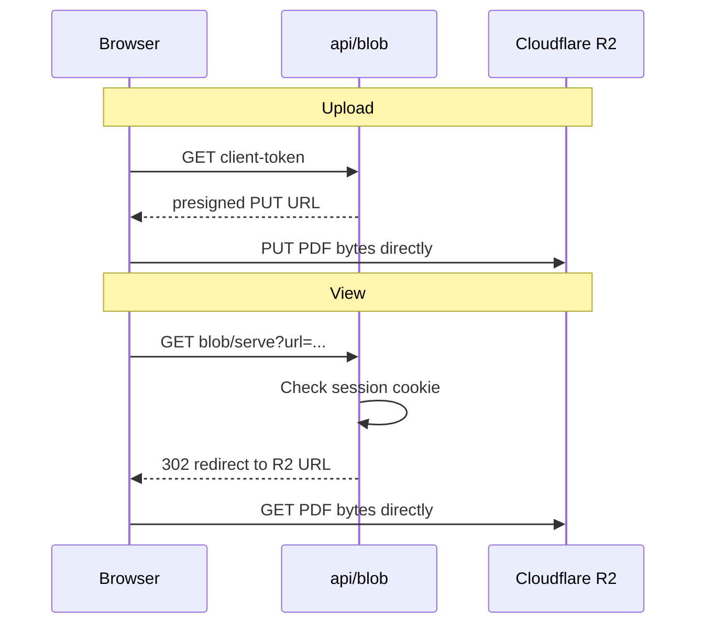

### Files involved

| File | Role |
|------|------|
| [`lib/storage-backend.ts`](../lib/storage-backend.ts) | R2 client, presign, list, delete |
| [`lib/upload-client.ts`](../lib/upload-client.ts) | Browser upload with retry |
| [`lib/pdf-client-url.ts`](../lib/pdf-client-url.ts) | Chooses serve vs proxy URL |
| [`app/api/blob/client-token/route.ts`](../app/api/blob/client-token/route.ts) | Upload permission |
| [`app/api/blob/serve/route.ts`](../app/api/blob/serve/route.ts) | Read gate + 302 redirect |
| [`public/sw.js`](../public/sw.js) | Cache PDFs for offline |

### Step-by-step: viewing a PDF

1. Session has `document.file_url` pointing at R2.
2. UI calls `pdfClientLoadUrl(url)` in [`lib/pdf-client-url.ts`](../lib/pdf-client-url.ts).
3. If URL is already public R2 base → use as-is (skip Vercel).
4. Else if R2 URL → `/api/blob/serve?url=...`.
5. Serve route checks cookie, builds presigned GET or public URL, returns **302**.
6. Browser follows redirect; `react-pdf` loads from R2.
7. Service worker may cache the PDF for offline re-reads.

### Important functions

#### `pdfClientLoadUrl(pdfUrl)` — `lib/pdf-client-url.ts`

**What:** Picks the right URL for the PDF viewer.  
**Returns:** Direct R2 URL, `/api/blob/serve?...`, or `/api/proxy/pdf?...`.  
**Called by:** `PdfViewer`, `PageViewerModal`, dashboard bookmark viewer.

#### `r2PresignedGetUrl(key, opts)` — `lib/storage-backend.ts`

**What:** Creates a temporary read URL (default 1 hour) for private files.  
**Returns:** HTTPS URL string.  
**Called by:** `/api/blob/serve` for private keys.

#### `publicR2UrlFor(key)` — `lib/storage-backend.ts`

**What:** Builds public `r2.dev` URL for keys under `public/`.  
**Returns:** URL or `null` if `R2_PUBLIC_BASE_URL` not configured.

#### `uploadPdfToStorage(file, opts)` — `lib/upload-client.ts`

**What:** Browser-side upload: gets token from API, PUTs or multipart-uploads to R2.  
**Returns:** Final public URL string.  
**Called by:** `DocumentPicker`, admin upload tab.

#### `GET` handler — `app/api/blob/serve/route.ts`

**What:** Auth gate + redirect dispatcher (public URL vs presigned vs legacy proxy).  
**Calls:** `getUserId()`, `r2KeyFromUrl()`, `publicR2UrlFor()`, `r2PresignedGetUrl()`.

### Libraries used

- `@aws-sdk/client-s3`, `@aws-sdk/s3-request-presigner`, `@aws-sdk/lib-storage`  
- `react-pdf` on the client  

### Why we built it this way

- Direct browser ↔ R2 path eliminates Vercel bandwidth charges for PDF bytes.
- Presigned URLs mean R2 credentials never ship to the browser — only a time-limited link.
- `/api/blob/serve` still exists so we can revoke access (check cookie before redirect).

---

## Feature 5 — AI: notes, quiz, flashcards, velocity, videos

### What this feature does

After or during study, OpenAI generates notes, quizzes, flashcards, a reaction-speed game (Velocity), and video suggestions from the text the user read. Outputs are validated, fact-checked where needed, and saved to the database.

### Key terms

- **Prompt** — Instructions sent to the AI ("generate 5 flashcards per formula…").
- **Structured output** — AI must return JSON matching a Zod schema.
- **Token** — AI billing unit (~4 characters of text); tracked per user.
- **Fact-check pass** — Second AI call verifies quiz/velocity answers.

### Flow diagram

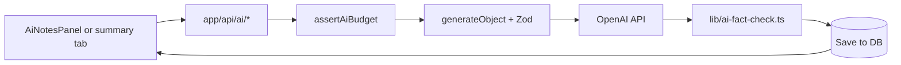

### Files involved

| File | Role |
|------|------|
| [`lib/ai.ts`](../lib/ai.ts) | OpenAI client, model id, `isAiConfigured()` |
| [`lib/ai-usage.ts`](../lib/ai-usage.ts) | Token budgets |
| [`lib/ai-fact-check.ts`](../lib/ai-fact-check.ts) | Quiz/velocity verification |
| [`components/study/AiNotesPanel.tsx`](../components/study/AiNotesPanel.tsx) | Notes UI in session |
| [`app/api/ai/notes/route.ts`](../app/api/ai/notes/route.ts) | Per-page notes |
| [`app/api/ai/flashcards/route.ts`](../app/api/ai/flashcards/route.ts) | Flashcard generation |
| [`app/api/ai/quiz/route.ts`](../app/api/ai/quiz/route.ts) | Quiz generation |
| [`app/api/ai/velocity/route.ts`](../app/api/ai/velocity/route.ts) | Velocity game |
| [`app/api/ai/videos/route.ts`](../app/api/ai/videos/route.ts) | Video suggestions |
| [`lib/youtube.ts`](../lib/youtube.ts) | YouTube Data API search |

### Shared pipeline (every AI route)

1. `getAppUser()` — must be logged in.
2. `isAiConfigured()` — if no `OPENAI_API_KEY`, return 503.
3. `assertAiBudget(userId)` — if over token limit, return 429.
4. Load session text from DB or request body.
5. `generateObject({ model, schema, prompt })` from `ai` package.
6. Optional: `factCheckQuizQuestions()` or similar.
7. `recordAiUsage()` — increment `users.ai_tokens_used`.
8. Save result to appropriate table.
9. Return JSON to UI.

### Important functions

#### `isAiConfigured()` — `lib/ai.ts`

**What:** Returns whether `OPENAI_API_KEY` is set.  
**Returns:** boolean.  
**Called by:** Every `/api/ai/*` route before calling OpenAI.

#### `assertAiBudget(userId)` — `lib/ai-usage.ts`

**What:** Pre-flight check for AI token quota.  
**Returns:** `null` if OK, or a ready-to-return `NextResponse` with status 429.  
**Called by:** Start of every AI route.

#### `recordAiUsage(...)` — `lib/ai-usage.ts`

**What:** Adds prompt+completion tokens to user's lifetime counter; logs to `ai_usage_logs`.  
**Called by:** After successful `generateObject` / `generateText`.

#### `factCheckQuizQuestions(questions, sourceText)` — `lib/ai-fact-check.ts`

**What:** Sends questions to AI verifier; drops or fixes wrong ones.  
**Returns:** Filtered question array.  
**Called by:** Quiz and Velocity generation routes.

#### `generateObject(...)` — `ai` package (used in routes)

**What:** Calls OpenAI and parses response into a Zod-defined TypeScript object.  
**Not our function** — library API; every AI route uses this pattern.

#### `AiNotesPanel` generate handler — `components/study/AiNotesPanel.tsx`

**What:** `POST /api/ai/notes` with `sessionId` + page text.  
**Updates:** Local `notes` state and `generatedPages` set.

#### `searchTopVideoCandidates(...)` — `lib/youtube.ts`

**What:** Uses YouTube Data API to find real video URLs for topics.  
**Fallback:** Channel search URL if API key missing.

### Per-route breakdown

| Route | When it runs | Saves to | Special logic |
|-------|--------------|----------|---------------|
| `POST /api/ai/notes` | User clicks Generate on a PDF page | `ai_notes` | Pulls page text from session; renders LaTeX via `ai-notes-render` |
| `POST /api/ai/quiz` | Summary Quiz tab (first open) | `quizzes` | `factCheckQuizQuestions`; min/max from user settings |
| `POST /api/ai/quiz/review` | After quiz with wrong answers | returns JSON only | Growth areas + recap; feeds `ReviewPanel` |
| `POST /api/ai/flashcards` | Summary Flashcards tab | `flashcards` | Initializes FSRS columns (`srs_state=0`) |
| `POST /api/ai/velocity` | Summary Velocity tab | in-memory until complete | Fact-check pairs; `SPEED_MS_PER_CHAR` for typing window |
| `POST /api/ai/velocity/grade` | Each short-answer in Velocity | returns grade | `selfCheckGraderVerdict` second opinion |
| `POST /api/ai/velocity/complete` | Velocity game finished | `velocity_games` | Aggregates score + timing |
| `POST /api/ai/velocity/report` | User reports bad question | logs only | Admin can inspect in AI Content tab |
| `GET /api/ai/videos` | Review tab or summary | returns URLs | YouTube search via `lib/youtube.ts` |

**Owner AI prompt overrides:** Admin edits extra prompt fragments in Owner AI tab → stored in `app_settings` via [`lib/app-settings.ts`](../lib/app-settings.ts) → merged into each route's system prompt at runtime.

### Libraries used

- `ai`, `@ai-sdk/openai`, `zod`  
- `unpdf` (server TOC extract, separate from notes)  

### Why we built it this way

- Zod schemas prevent broken quiz JSON from reaching the UI.
- Fact-check pass catches hallucinated formulas before students see them.
- Central `assertAiBudget` + `recordAiUsage` enforces quotas without duplicating logic in 8 routes.

---

## Feature 6 — Spaced repetition (`/review`)

### What this feature does

Flashcards you generated get scheduled by the FSRS algorithm. `/review` shows a home screen (filters) then a fullscreen flip-card session. You grade each card (Very Hard / Hard / Medium / Easy); the app schedules when you'll see it again.

### Key terms

- **FSRS** — Modern spaced repetition algorithm; uses stability and difficulty per card.
- **Due** — Card's `due_at` is in the past — time to review.
- **New** — Never graded (`srs_state = 0`).
- **Learning / Relearning** — Short intervals (minutes); may return in same session.
- **Mature** — In Review state with multi-day intervals.

### Flow diagram

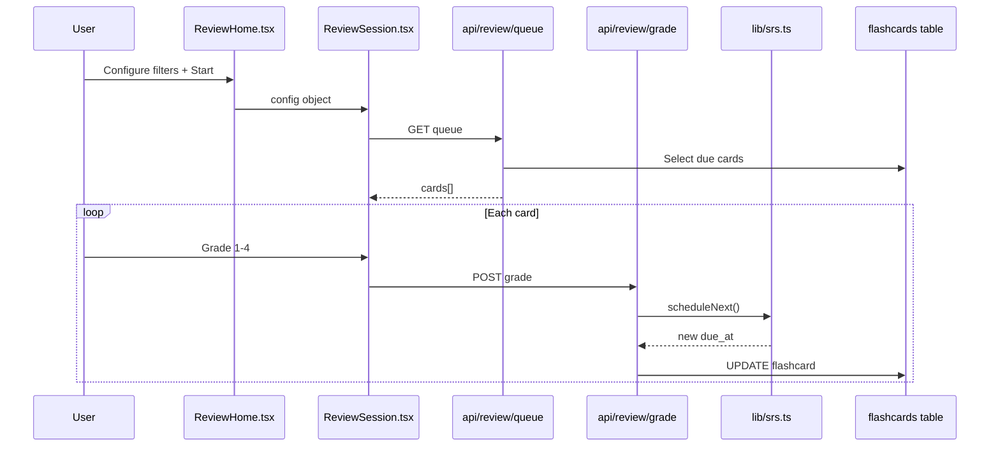

### Files involved

| File | Role |
|------|------|
| [`app/review/page.tsx`](../app/review/page.tsx) | Home ↔ session switch |
| [`components/review/ReviewHome.tsx`](../components/review/ReviewHome.tsx) | Filters UI |
| [`components/review/ReviewSession.tsx`](../components/review/ReviewSession.tsx) | Flip + grade UI |
| [`lib/srs.ts`](../lib/srs.ts) | FSRS wrapper |
| [`app/api/review/queue/route.ts`](../app/api/review/queue/route.ts) | Build card list |
| [`app/api/review/grade/route.ts`](../app/api/review/grade/route.ts) | Save grade |
| [`app/api/review/decks/route.ts`](../app/api/review/decks/route.ts) | Deck list for home |
| [`lib/review-deck-title.ts`](../lib/review-deck-title.ts) | Deck title fallback |

### Step-by-step: grade one card

1. User reveals card back, presses e.g. **Medium** (FSRS grade 3).
2. `onGrade()` in `ReviewSession` POSTs `{ cardId, grade: 3 }` to `/api/review/grade`.
3. Grade route loads flashcard, verifies ownership via session join.
4. Calls `scheduleNext(currentState, grade)` in [`lib/srs.ts`](../lib/srs.ts).
5. FSRS returns new `stability`, `difficulty`, `due_at`, `srs_state`, etc.
6. Route UPDATEs `flashcards` row.
7. UI removes card from front of queue (or pushes to back if relearning).
8. On session end, `POST /api/review/session` writes synthetic `study_sessions` row for streak credit.

### Important functions

#### `scheduleNext(state, grade)` — `lib/srs.ts`

**What:** Runs FSRS algorithm for one grade press.  
**Inputs:** Current `FlashcardSrsState`, grade 1–4.  
**Returns:** `ScheduleResult` with new due date and state columns.  
**Called by:** `/api/review/grade` only (server-side truth).

#### `previewAllGrades(state)` — `lib/srs.ts`

**What:** Computes what would happen for all four grades (for button interval labels).  
**Called by:** `ReviewSession` UI before user picks.

#### `formatInterval(days)` — `lib/srs.ts`

**What:** Turns `1.5` days into display string `"1d"` or `"10m"`.  
**Called by:** Grade button labels in UI.

#### `loadQueue()` — `components/review/ReviewSession.tsx`

**What:** `fetch`es `/api/review/queue` with config query params; filters out already-graded IDs.  
**Called by:** Mount and optional refill in `mode=due`.

#### `onGrade(grade)` — `components/review/ReviewSession.tsx`

**What:** POST grade, update local queue, track `reviewedIdsRef`.  
**Calls:** `/api/review/grade`.

#### `parseDeckParam(raw)` — `app/api/review/queue/route.ts`

**What:** Parses `decks=tc:abc,d:xyz` query string into filter struct.  
**Used by:** Queue and decks routes.

#### `resolveDeckTitle(...)` — `lib/review-deck-title.ts`

**What:** Falls back to `document_json.title` when document link missing.  
**Used by:** `/api/review/decks`, `/api/review/queue`.

### Review home modes (`ReviewHome.tsx` → queue query)

| Mode | Query param | Caps from settings? | Behavior |
|------|-------------|-------------------|----------|
| `due` | `mode=due` | Yes — `srsNewPerDay`, `srsReviewsPerDay` | Default; refetches when queue empty |
| `all` | `mode=all` | No | Every card in selected decks |
| `new` | `mode=new` | No | `srs_state = 0` only |
| `learning` | `mode=learning` | No | Learning + relearning states |
| `mature` | `mode=mature` | No | Review state with interval ≥ 21 days |

**Deck filter:** `decks=tc:<catalogId>,d:<documentId>` — parsed by `parseDeckParam`.  
**Max card age:** `maxAgeDays=N` filters cards by `created_at`.  
**Limit:** optional `limit=N` (blank = no cap on home screen).

**Loop fix:** `reviewedIdsRef` in `ReviewSession` prevents the same card appearing twice after a `due` mode refetch.

### Why interval previews differ per card

Each card has its own **stability** (how well memory is established) and **difficulty**. Pressing **Medium** on a brand-new card might schedule ~10 minutes (Learning). Pressing **Medium** on a mature card might schedule ~30 days. That is correct — not a bug.

### Libraries used

- `ts-fsrs` (only imported in `lib/srs.ts`)

### Why we built it this way

- FSRS in one wrapper file → swap algorithm later without touching UI.
- Home screen filters bypass daily caps only in explicit modes (`all`, `new`, etc.); `due` mode respects settings caps.
- Synthetic review session row reuses existing streak logic without forking streak code.

See also: [`srs-update.md`](srs-update.md).

---

## Feature 7 — Dashboard (homepage)

### What this feature does

[`/dashboard`](../app/dashboard/page.tsx) is the signed-in homepage. It aggregates many independent widgets, each loading its own API data.

### Key terms

- **Streak** — Consecutive days with at least one completed study or review session.
- **Grace day** — Not studying today alone does not break a streak; missing today and yesterday does.
- **Heatmap** — GitHub-style grid of study minutes per day for the past year.

### Flow diagram

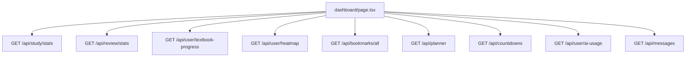

### Files involved

| File | Role |
|------|------|
| [`app/dashboard/page.tsx`](../app/dashboard/page.tsx) | All widgets + `MessageModal` + `ActivityMonthModal` + `PageViewerModal` |
| [`app/api/study/stats/route.ts`](../app/api/study/stats/route.ts) | Streak, weekly chart, daily goals, active session banner |
| [`app/api/review/stats/route.ts`](../app/api/review/stats/route.ts) | Due flashcard counts for SRS card |
| [`app/api/user/textbook-progress/route.ts`](../app/api/user/textbook-progress/route.ts) | Per-book unique pages read |
| [`app/api/user/heatmap/route.ts`](../app/api/user/heatmap/route.ts) | 365-day activity grid |
| [`app/api/user/activity-month/route.ts`](../app/api/user/activity-month/route.ts) | One month detail for modal |
| [`app/api/bookmarks/all/route.ts`](../app/api/bookmarks/all/route.ts) | All bookmarks for list |
| [`app/api/planner/route.ts`](../app/api/planner/route.ts) | Weekly study blocks |
| [`app/api/countdowns/route.ts`](../app/api/countdowns/route.ts) | Exam countdowns |
| [`app/api/messages/route.ts`](../app/api/messages/route.ts) | Unread count + thread |

### Step-by-step: opening the dashboard

1. Logged-in user visits `/` → server redirects to `/dashboard` ([`app/page.tsx`](../app/page.tsx)).
2. `dashboard/page.tsx` mounts; multiple `useEffect` hooks fire parallel `fetch` calls.
3. **Streak card** reads `stats.streak`, `stats.studiedToday` from `/api/study/stats`.
4. **Due today card** reads `/api/review/stats`; hidden if nothing due.
5. **Textbook progress** bars from `/api/user/textbook-progress` (union of unique pages, not sum).
6. **Heatmap** from `/api/user/heatmap`; click opens `ActivityMonthModal` → `/api/user/activity-month?year=&month=`.
7. **Bookmarks** list from `/api/bookmarks/all`; click opens `PageViewerModal` with `pdfClientLoadUrl`.
8. Bottom nav: **Message Developer** opens modal; **Log out** calls `signOut`.

### Widget reference

| Widget | Data source | User action |
|--------|-------------|-------------|
| Streak | `study/stats` | Informational; links to activity |
| Due today | `review/stats` | Links to `/review` |
| Daily goal | `study/stats` | Shows minutes/sessions vs targets from settings |
| Weekly chart | `study/stats` | Bar chart of last 7 days |
| Textbook progress | `textbook-progress` | Per catalog book % |
| Bookmarks | `bookmarks/all` | Open PDF at saved page |
| Planner | `planner` | Add/delete study blocks |
| Countdowns | `countdowns` | Exam date countdowns |
| AI usage card | `user/ai-usage` | Token spend breakdown |
| Active session banner | `study/stats` | Resume link to `/study/session?resume=` |

### Important functions

#### `handleSignOut()` — `app/dashboard/page.tsx`

**What:** `signOut({ callbackUrl: "/" })` from `next-auth/react`.  
**Called by:** Header and bottom **Log out** buttons.

#### `MessageModal` — `app/dashboard/page.tsx`

**What:** Modal with chat history + send box.  
**Loads:** `GET /api/messages?asUser=1` (thread shape, not admin conversations list).  
**Sends:** `POST /api/messages` with `{ content }`.

#### Streak logic — `app/api/study/stats/route.ts`

**What:** Walks backward from today/yesterday counting days with ended sessions or `goal_type = "review"`.  
**Grace:** If no session today, streak still counts from yesterday backward.

#### `ActivityMonthModal` — `app/dashboard/page.tsx`

**What:** Full month calendar with prev/next arrows, keyboard ←/→.  
**Loads:** `GET /api/user/activity-month?year=YYYY&month=MM`.

#### `PageViewerModal` — `app/dashboard/PageViewerModal.tsx`

**What:** Lightweight PDF viewer for a bookmark without starting a full session.  
**Uses:** `pdfClientLoadUrl()` for correct R2/proxy URL.

### Libraries used

- `next-auth/react`, Drizzle aggregations, `react-pdf` (in modal)

### Why we built it this way

- Many small fetches let widgets fail independently without blanking the whole page.
- Review streak credit uses synthetic `study_sessions` rows — no duplicate streak algorithm.

---

## Feature 8 — Admin panel (developer console)

### What this feature does

[`/admin`](../app/admin/page.tsx) is a single large file (~3500+ lines) with tabbed tools for admins. **Use editor search** (`UsersTab`, `MessagesTab`, etc.) — do not read linearly.

### Key terms

- **Impersonation** — `sf.view-as-user` cookie; `getAppUser()` returns target user for data routes.
- **Super-owner** — Hardcoded email + `is_owner` DB flag; unlocks Owner AI and dev debug logs.
- **View-as banner** — [`ImpersonationBanner`](../components/AppChrome.tsx) shows when impersonating.

### Flow diagram

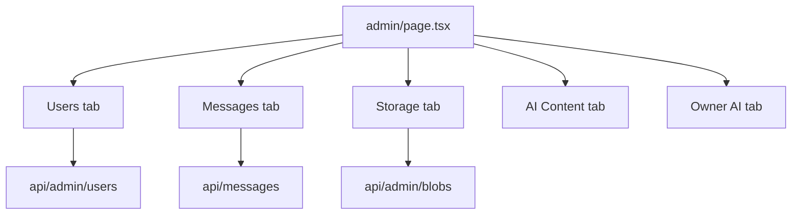

### Files involved

| File | Role |
|------|------|
| [`app/admin/page.tsx`](../app/admin/page.tsx) | All admin UI tabs |
| [`lib/admin.ts`](../lib/admin.ts) | `requireAdmin`, `requireSuperOwner`, `requireSameOrigin` |
| [`app/api/admin/*`](../app/api/admin/) | All admin mutations |
| [`components/admin/OwnerAiTab.tsx`](../components/admin/OwnerAiTab.tsx) | Owner AI copilot |
| [`components/admin/AiContentTab.tsx`](../components/admin/AiContentTab.tsx) | Browse/edit AI output |
| [`components/admin/AdminStudyCalendar.tsx`](../components/admin/AdminStudyCalendar.tsx) | User study calendar |

### Admin tabs explained

#### Users tab

- Lists all users from `GET /api/admin/users`.
- **Manage** drawer: storage quota, AI token limit, mute/block, impersonate, delete user.
- Session detail: page reading time (wall vs focused), dev-only focused-per-page chart.
- Study time by day chart (7-day bars or 30-day calendar).

#### Messages tab

- `GET /api/messages` → conversation list (admin shape).
- Select user → `GET /api/messages?userId=X` → thread.
- Reply → `POST /api/messages` with `{ content, toUserId }`.
- Mute/block via `POST /api/admin/mute-block`.

#### App UI tab

- Edit global copy/styles for Home, Dashboard, Session, Settings screens.
- `PUT /api/admin/ui-copy` saves `{ version: 2, pages }`.
- Client reads via `GET /api/app/ui-copy` in [`UiCopyProvider`](../components/ui-copy/UiCopyProvider.tsx).

#### Upload to Archive tab

- Upload PDF to R2 + optional catalog row.
- AI TOC extract: `POST /api/admin/extract-toc` → review in `TocEditor` → save catalog.

#### Textbook Catalog tab

- CRUD on `textbook_catalog` via `GET/POST/PATCH /api/admin/catalog`.

#### AI Content tab

- Browse all persisted AI output across users (notes, quiz questions, flashcards, velocity).
- Edit/delete via `PATCH/DELETE /api/admin/ai-content/item`.

#### Storage (R2) tab

- `GET /api/admin/blobs` lists bucket objects with uploader attribution.
- Preview via `/api/blob/serve?url=...`.

#### Debug Log tab (super-owner)

- User errors from `POST /api/debug/client-error`.
- Dev logs from `reportDevDebug()` → `POST /api/debug/dev-log`.

#### Owner AI tab (super-owner)

- Configure model, prompts, product context.
- Chat copilot with apply/suggest patches to live settings.

### Step-by-step: admin impersonation

1. Admin opens Users tab → **View as** on a user.
2. `POST /api/admin/impersonate` with `{ userId }` sets `sf.view-as-user` cookie.
3. Admin navigates to `/dashboard` — data APIs use `getAppUser()` → target user's data.
4. `/api/admin/*` still uses real JWT via `auth()` for permission checks.
5. Banner shows impersonation; **Stop viewing as** clears cookie.

### Important functions

#### `requireAdmin()` — `lib/admin.ts`

**What:** Throws/403 if caller is not admin.  
**Used by:** All `/api/admin/*` routes.

#### `requireSuperOwner()` — `lib/admin.ts`

**What:** Stricter check for Owner AI and dev logs.

#### `requireSameOrigin()` — `lib/admin.ts`

**What:** CSRF-style check on destructive admin POSTs.

#### `POST /api/admin/impersonate`

**What:** Sets or clears `VIEW_AS_COOKIE`.

#### `MessagesTab` — `app/admin/page.tsx`

**What:** Full admin messaging UI; mute picker with duration presets.

### Why we built it this way

- One admin file = fast iteration for a single developer audience.
- Impersonation via cookie keeps admin JWT privileges while viewing user data.

---

## Feature 9 — PWA, offline sessions, PDF cache

### What this feature does

Bowl Beacon can be installed as a PWA. A service worker caches the app shell and PDFs. If the network drops mid-session, progress is saved to `localStorage` and synced when back online.

### Key terms

- **Cache-first** — Try cached copy before network (used for PDFs).
- **Network-first** — Try network, fall back to cache (used for app pages).
- **Stale-while-revalidate** — Show cache immediately, refresh in background (stats APIs).

### Flow diagram

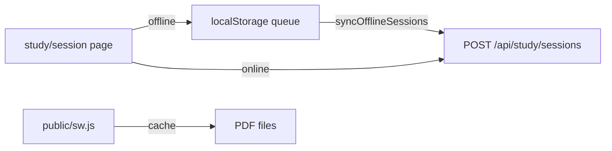

### Files involved

| File | Role |
|------|------|
| [`public/sw.js`](../public/sw.js) | Service worker caching rules |
| [`lib/offline-session.ts`](../lib/offline-session.ts) | Offline queue in localStorage |
| [`lib/client/pdf-cache-sw.ts`](../lib/client/pdf-cache-sw.ts) | PDF cache helpers |
| [`app/layout.tsx`](../app/layout.tsx) | Registers service worker |

### Important functions

#### `enqueueOfflineSession(data)` — `lib/offline-session.ts`

**What:** Saves new session to localStorage with `offline-*` temp id.  
**Returns:** `tempId` string.  
**Called when:** `POST /api/study/sessions` fails due to network.

#### `syncOfflineSessions()` — `lib/offline-session.ts`

**What:** Replays all queued sessions to the server.  
**Called:** On app mount and `window.online` event.  
**Steps per queued session:**  
1. `POST /api/study/sessions` with original `startedAt` → receive real `id`.  
2. Move `sessionStorage` text from `session-text-<tempId>` to `session-text-<realId>`.  
3. `PATCH /api/study/sessions` with minutes, pages, optional `endedAt`.  
4. Remove from queue; fire `offlineSessionSynced` event so UI swaps temp id for real id.

#### `updateOfflineSession(tempId, patch)` — `lib/offline-session.ts`

**What:** Updates progress snapshot for a queued offline session.

#### `isOfflineId(id)` — `lib/offline-session.ts`

**What:** True when id starts with `offline-`; session page shows sync-pending state.

### Step-by-step: offline mid-session

1. Network drops during study → `saveProgress` fails → `enqueueOfflineSession` or `updateOfflineSession`.
2. User keeps reading; PDF may load from service worker cache (`public/sw.js`).
3. Network returns → `syncOfflineSessions()` in layout or session page.
4. Server creates session with correct historical start time; streak and heatmap stay accurate.

### Libraries used

- Browser `localStorage` API  
- Service worker API (vanilla JS in `sw.js`)  

### Why we built it this way

- Offline queue preserves study time integrity — `startedAt` is sent on sync so stats stay honest.
- PDF cache is optional (Settings toggle) — clearing it frees device storage.

---

## Feature 10 — Settings (`/settings`)

### What this feature does

[`app/settings/page.tsx`](../app/settings/page.tsx) is where users configure daily goals, quiz question counts, inactivity timeout, Pomodoro timers, SRS daily caps, PDF offline cache, study music playlist, theme, Boss Beacons exit protection, login password, and storage usage.

### Key terms

- **NumberField** — Shared input that allows blank while editing but validates on save ([`components/forms/NumberField.tsx`](../components/forms/NumberField.tsx)).
- **Exit protection** — Boss Beacons toggle (always visible); login password form hidden until user verifies current login password.

### Files involved

| File | Role |
|------|------|
| [`app/settings/page.tsx`](../app/settings/page.tsx) | All settings sections |
| [`app/api/user/settings/route.ts`](../app/api/user/settings/route.ts) | GET/PATCH preferences + password branches |
| [`app/api/user/verify-login-password/route.ts`](../app/api/user/verify-login-password/route.ts) | Unlock password forms |
| [`app/api/user/storage/route.ts`](../app/api/user/storage/route.ts) | Storage quota display |
| [`lib/forms/numberField.ts`](../lib/forms/numberField.ts) | `validatePositiveInt` |
| [`lib/types/settings-layout.ts`](../lib/types/settings-layout.ts) | Section ordering |

### Step-by-step: saving daily goals

1. Page loads → `GET /api/user/settings` fills form state.
2. User edits minutes/sessions/quiz min-max fields (strings, can be empty while typing).
3. User clicks **Save goals** → `validatePositiveInt` on each field.
4. `PATCH /api/user/settings` with numeric values.
5. Success message shown inline.

### Settings sections

| Section | API fields | Notes |
|---------|------------|-------|
| Daily goals | `dailyMinutesGoal`, `dailySessionsGoal`, `inactivityTimeoutMin`, `quizMinQuestions`, `quizMaxQuestions` | Validated 1–25 for quiz max |
| Spaced repetition | `srsNewPerDay`, `srsReviewsPerDay` | Caps for `mode=due` review |
| Pomodoro | `pomodoroEnabled`, focus/break/cycles minutes | Used in study session |
| PDF cache | client prefs + SW message | Toggle in settings |
| Music | playlist in user settings JSON | Search via `/api/music/search` |
| Passwords | `newLoginPassword`, `newExitPassword` | Requires unlock + current password |
| Storage | `GET /api/user/storage` | Used vs quota bar |

### Important functions

#### `GET/PATCH /api/user/settings`

**What:** Central user preferences API.  
**PATCH branches:** numeric prefs OR login password change OR `exitBossBeaconsEnabled` (mutually exclusive per request).

#### `validatePositiveInt(raw, opts)` — `lib/forms/numberField.ts`

**What:** Ensures saved numbers are positive; empty string → error on submit.

### Why we built it this way

- String-controlled number fields fix "snap to zero" UX bug when clearing inputs.
- Password unlock prevents shoulder-surfing on shared devices.

---

## Feature 11 — Post-session summary

### What this feature does

After ending a study session, user lands on [`/study/session/[id]/summary`](../app/study/session/[id]/summary/page.tsx) with tabs: **Stats**, **Notes**, **Quiz**, **Review** (wrong answers), **Flashcards**, **Velocity**.

### Key terms

- **Review tab** — Targeted recap of quiz questions you missed (not SRS `/review`).
- **Velocity** — Timed reaction game with toss-up/bonus question pairs.

### Flow diagram

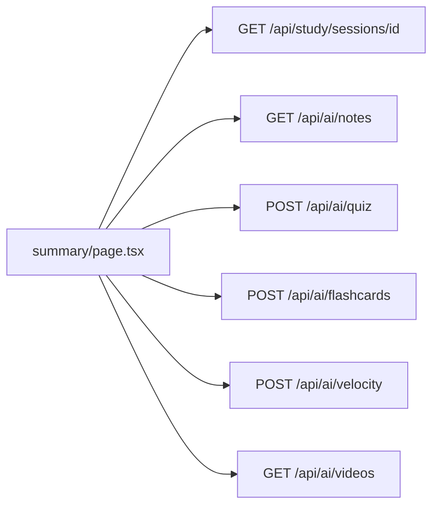

### Files involved

| File | Role |
|------|------|
| [`app/study/session/[id]/summary/page.tsx`](../app/study/session/[id]/summary/page.tsx) | Tab shell + data loading |
| [`components/study/QuizView.tsx`](../components/study/QuizView.tsx) | Multiple-choice quiz UI |
| [`components/study/ReviewPanel.tsx`](../components/study/ReviewPanel.tsx) | Wrong-answer review + videos |
| [`components/study/FlashcardView.tsx`](../components/study/FlashcardView.tsx) | Flip cards with keyboard nav |
| [`components/study/VelocityGame.tsx`](../components/study/VelocityGame.tsx) | Speed game UI |
| [`app/api/ai/quiz/review/route.ts`](../app/api/ai/quiz/review/route.ts) | AI review of wrong answers |

### Step-by-step: taking the quiz

1. User opens **Quiz** tab → if no `quizzes` row, `POST /api/ai/quiz` generates questions (fact-checked).
2. `QuizView` steps through questions; tracks wrong answers.
3. On complete → `PATCH` quiz with score; optional `POST /api/ai/quiz/review` for wrong-answer recap.
4. **Review** tab shows `ReviewPanel` with growth areas + video suggestions.

### Step-by-step: Velocity game

1. User opens **Velocity** tab → `POST /api/ai/velocity` generates question pairs (fact-checked).
2. `VelocityGame` shows toss-up then bonus; times reaction with `SPEED_MS_PER_CHAR`.
3. Short answers graded via `POST /api/ai/velocity/grade` (with self-check pass).
4. `POST /api/ai/velocity/complete` saves results to `velocity_games`.

### Important functions

#### `QuizView` `onComplete(score, total, wrongAnswers)`

**What:** Parent saves score and triggers review generation.

#### `factCheckQuizQuestions` / `factCheckVelocityQuestions` — `lib/ai-fact-check.ts`

**What:** Second AI pass drops/fixes bad questions before user sees them.

#### `selfCheckGraderVerdict` — `lib/ai-fact-check.ts`

**What:** When velocity SA grader says wrong, second opinion can flip to correct.

#### `stripLatexForAiNotes` / `aiNoteContentToHtml` — `lib/ai-notes-render.ts`

**What:** Notes tab rendering helpers.

### Why we built it this way

- Summary centralizes all post-study AI tools in one place per session.
- Fact-check pipeline shared between quiz and velocity reduces hallucinations.

---

## Feature 12 — Bookmarks, highlights, and page visits

### What this feature does

While reading a PDF, users bookmark pages or highlight text. The PDF viewer also records **page visits** (time on each page) for analytics and admin diagnostics.

### Files involved

| File | Role |
|------|------|
| [`components/study/PdfViewer.tsx`](../components/study/PdfViewer.tsx) | Creates bookmarks, batches page visits |
| [`app/api/bookmarks/route.ts`](../app/api/bookmarks/route.ts) | CRUD bookmarks/highlights |
| [`app/api/bookmarks/all/route.ts`](../app/api/bookmarks/all/route.ts) | Dashboard list |
| [`app/api/page-visits/batch/route.ts`](../app/api/page-visits/batch/route.ts) | Flush visit batch |

### Step-by-step: page visit tracking

1. User navigates to page N in `PdfViewer`.
2. Component records `enteredAt`; tracks whether parent timer `isPaused`.
3. Every ~30s or on page leave, visits flush to `POST /api/page-visits/batch`.
4. Each visit stores `duration_seconds` (wall) and `focused_seconds` (timer running only).
5. Session progress PATCH also sends `visitedPagesList` as unique page numbers.

### Important functions

#### `POST /api/page-visits/batch`

**What:** Inserts/updates many visit rows; clamps `focusedSeconds` ≤ `durationSeconds`.

#### `GET /api/bookmarks/all`

**What:** Returns all user bookmarks for dashboard widget.

### Why we built it this way

- Batch flush reduces API chatter during long reading sessions.
- `focused_seconds` enables honest "time actually studying" vs idle on page.

---

## Feature 13 — User drive, documents, and textbook catalog

### What this feature does

Users upload PDFs to **My Drive**, link external PDFs, import ZIPs, and pick from a shared **textbook catalog**. Documents store TOC JSON, page offset, and R2 URL.

### Files involved

| File | Role |
|------|------|
| [`components/study/DocumentPicker.tsx`](../components/study/DocumentPicker.tsx) | Drive / upload / catalog UI |
| [`components/study/TocEditor.tsx`](../components/study/TocEditor.tsx) | Chapter page range editor |
| [`app/api/user/drive/route.ts`](../app/api/user/drive/route.ts) | List/delete drive |
| [`app/api/user/drive/import/route.ts`](../app/api/user/drive/import/route.ts) | ZIP import |
| [`app/api/documents/[id]/route.ts`](../app/api/documents/[id]/route.ts) | Metadata + TOC PATCH |
| [`app/api/documents/register/route.ts`](../app/api/documents/register/route.ts) | After client upload |
| [`app/api/textbooks/route.ts`](../app/api/textbooks/route.ts) | Catalog list |
| [`lib/storage.ts`](../lib/storage.ts) | Quota checks |
| [`lib/toc-editor-utils.ts`](../lib/toc-editor-utils.ts) | TOC JSON helpers |

### Step-by-step: upload PDF

1. User selects file in `DocumentPicker` → `uploadPdfToStorage()` (see Feature 4).
2. `POST /api/documents/register` creates `documents` row, updates `users.storage_bytes`.
3. `DocTocEditor` / `TocEditor` opens for chapter ranges + offset.
4. `PATCH /api/documents/[id]` saves `chapterPageRanges`, `pageOffset`, `title`.

### Important functions

#### `uploadPdfToStorage` — `lib/upload-client.ts`

**What:** Full client upload orchestration (token → PUT/multipart → URL).

#### Storage quota — `lib/storage.ts`

**What:** Default 350 MB per user; `register` returns 413 if over quota.

#### `ensure-imported` — `app/api/documents/ensure-imported/route.ts`

**What:** Resolves catalog PDF URL (cached R2 or proxy).

### Why we built it this way

- Client-direct upload keeps large PDFs off Vercel body limits.
- Per-user quota prevents storage abuse on free tier.

---

## Feature 14 — Study history

### What this feature does

[`/study/history`](../app/study/history/page.tsx) lists past sessions with dates, goals, minutes, and links to summaries.

### Files involved

| File | Role |
|------|------|
| [`app/study/history/page.tsx`](../app/study/history/page.tsx) | History list UI |
| [`app/api/study/sessions/route.ts`](../app/api/study/sessions/route.ts) | `GET` list endpoint |

### Step-by-step

1. Page loads → `GET /api/study/sessions`.
2. Renders rows sorted by `startedAt`.
3. Click row → `/study/session/[id]/summary`.

---

## Feature 15 — Landing page, marketing, and global chrome

### What this feature does

Unauthenticated visitors see [`HomeLanding.tsx`](../app/HomeLanding.tsx) with sign-in/sign-up CTAs and PWA install hints. All pages wrap in [`AppChrome`](../components/AppChrome.tsx) for error reporting and impersonation banner.

### Files involved

| File | Role |
|------|------|
| [`app/page.tsx`](../app/page.tsx) | Redirect logged-in users to dashboard |
| [`app/HomeLanding.tsx`](../app/HomeLanding.tsx) | Marketing landing |
| [`components/AppChrome.tsx`](../components/AppChrome.tsx) | Error reporter + impersonation banner |
| [`components/ui-copy/UiCopyProvider.tsx`](../components/ui-copy/UiCopyProvider.tsx) | Global customizable text |
| [`lib/ui-copy-shared.ts`](../lib/ui-copy-shared.ts) | Client-safe copy helpers |
| [`app/api/debug/client-error/route.ts`](../app/api/debug/client-error/route.ts) | Stores JS errors |

### Important functions

#### `ClientErrorReporter` — `components/AppChrome.tsx`

**What:** `window.onerror` / `unhandledrejection` → `POST /api/debug/client-error`.

#### `SuiText` — `UiCopyProvider`

**What:** Renders admin-overridable strings per page/key.

#### `GET /api/app/ui-copy`

**What:** Public JSON of UI overrides for all screens.

---

## Feature 16 — Cumulative study goals

### What this feature does

Users can set a **multi-session time goal** (e.g. "study 120 minutes total across several sessions"). Progress sums ended sessions linked to the same `study_goals` row.

### Files involved

| File | Role |
|------|------|
| [`app/api/study/goals/route.ts`](../app/api/study/goals/route.ts) | List active goals |
| [`app/api/study/sessions/route.ts`](../app/api/study/sessions/route.ts) | `newMultiSessionGoal`, `continueStudyGoalId` on POST |
| `study_goals` table | [`lib/db/schema.ts`](../lib/db/schema.ts) |

### Important functions

#### `maybeCompleteStudyGoal` — `app/api/study/sessions/route.ts`

**What:** On session end, marks goal `completed` when sum of minutes ≥ target.

---

## Feature 17 — Music during study

### What this feature does

Optional study playlist in session: YouTube URLs or search results, persisted in user settings.

### Files involved

| File | Role |
|------|------|
| [`lib/music.ts`](../lib/music.ts) | Playlist parse, YouTube ID helpers |
| [`app/api/music/search/route.ts`](../app/api/music/search/route.ts) | Search proxy |
| [`app/study/session/page.tsx`](../app/study/session/page.tsx) | Music panel UI |

### Important functions

#### `parseYouTubeId`, `loadPlaylist`, `savePlaylist` — `lib/music.ts`

**What:** Client-side playlist storage in user settings JSON.

---

## Feature 18 — Planner, countdowns, and activity calendar

### What this feature does

Three related dashboard widgets help users plan *when* to study, track *exam deadlines*, and see *historical activity* in a calendar heatmap.

### Files involved

| File | Role |
|------|------|
| [`app/api/planner/route.ts`](../app/api/planner/route.ts) | CRUD weekly study blocks (`study_plans`) |
| [`app/api/countdowns/route.ts`](../app/api/countdowns/route.ts) | CRUD exam countdowns (`exam_countdowns`) |
| [`app/api/user/heatmap/route.ts`](../app/api/user/heatmap/route.ts) | 365-day minutes grid |
| [`app/api/user/activity-month/route.ts`](../app/api/user/activity-month/route.ts) | Single month detail |
| [`components/dashboard/HeatmapCalendar.tsx`](../components/dashboard/HeatmapCalendar.tsx) | Heatmap rendering |
| [`components/dashboard/ActivityMonthModal.tsx`](../components/dashboard/ActivityMonthModal.tsx) | Month drill-down modal |

### Step-by-step: add a planner block

1. User picks day-of-week, start/end time, optional label on dashboard.
2. `POST /api/planner` inserts `study_plans` row.
3. Widget re-fetches `GET /api/planner` and redraws weekly grid.
4. Delete → `DELETE /api/planner?id=<uuid>`.

### Step-by-step: exam countdown

1. User names an exam and picks a date.
2. `POST /api/countdowns` → `exam_countdowns` row.
3. Dashboard shows days remaining; `PATCH`/`DELETE` for edits.

### Activity heatmap

- `GET /api/user/heatmap` returns `{ date: minutes }` for ~365 days (study + review sessions).
- Click a month cell → `ActivityMonthModal` loads `/api/user/activity-month?year=&month=` with per-day session list.

### Why we built it this way

- Separate tables (`study_plans`, `exam_countdowns`) keep planner data independent from actual `study_sessions` outcomes.
- Heatmap reuses the same session aggregation as streak logic — one source of truth for "did I study that day?"

---

## Feature 19 — Message Developer (user ↔ admin chat)

### What this feature does

Users can send feedback or questions to the developer from the dashboard. Admins reply in the **Messages** admin tab. Muted/blocked users cannot send.

### Files involved

| File | Role |
|------|------|
| [`app/api/messages/route.ts`](../app/api/messages/route.ts) | GET thread / POST send / admin conversation list |
| [`app/dashboard/page.tsx`](../app/dashboard/page.tsx) | `MessageModal` UI |
| [`app/admin/page.tsx`](../app/admin/page.tsx) | `MessagesTab` for replies |
| [`app/api/admin/mute-block/route.ts`](../app/api/admin/mute-block/route.ts) | Mute duration or block user |

### Step-by-step: user sends a message

1. User clicks **Message Developer** on dashboard.
2. Modal fetches `GET /api/messages?asUser=1` → `{ messages, currentUserId }` thread shape.
3. User types and sends → `POST /api/messages` with `{ content }`.
4. Admin sees conversation in Messages tab (default GET without `asUser` returns `{ conversations }`).

### Important detail: `?asUser=1`

Admins are also users. Without `asUser=1`, admin GET returns the admin inbox shape (empty for their own thread). The dashboard modal always passes `asUser=1` so admins see their messages too.

### Why we built it this way

- One `messages` table with `sender_id` / `recipient_id` avoids a separate ticketing system.
- `asUser=1` flag keeps one route file for both user modal and admin inbox.

---

## Part 3 — Complete reference appendix

### All pages (URLs)

| URL | File | Who sees it |
|-----|------|-------------|
| `/` | `app/page.tsx` + `HomeLanding.tsx` | Logged-out visitors |
| `/auth/signin` | `app/auth/signin/page.tsx` | Everyone |
| `/auth/signup` | `app/auth/signup/page.tsx` | Everyone |
| `/dashboard` | `app/dashboard/page.tsx` | Signed-in users |
| `/study/session` | `app/study/session/page.tsx` | Signed-in users |
| `/study/session/[id]/summary` | `app/study/session/[id]/summary/page.tsx` | Session owner |
| `/study/history` | `app/study/history/page.tsx` | Signed-in users |
| `/review` | `app/review/page.tsx` | Signed-in users |
| `/settings` | `app/settings/page.tsx` | Signed-in users |
| `/admin` | `app/admin/page.tsx` | Admins only |

### All API routes (grouped)

Paths are under `/api`. Methods listed in ARCHITECTURE detail; summary below.

| Group | Routes |
|-------|--------|
| **Auth** | `auth/[...nextauth]`, `auth/signup` |
| **Debug** | `debug/client-error`, `debug/dev-log`, `admin/debug-logs` |
| **Impersonation** | `admin/impersonate`, `user/session-context` |
| **UI copy** | `app/ui-copy`, `admin/ui-copy` |
| **Study** | `study/sessions`, `study/sessions/[id]`, `study/stats`, `study/goals`, `study/chapters-read` |
| **Page visits** | `page-visits`, `page-visits/batch` |
| **Documents** | `documents/upload`, `documents/register`, `documents/[id]`, `documents/[id]/file`, `documents/ensure-imported` |
| **Textbooks** | `textbooks` |
| **Proxy** | `proxy/pdf` |
| **User** | `user/settings`, `user/storage`, `user/drive`, `user/drive/import`, `user/drive/link`, `user/ai-usage`, `user/textbook-progress`, `user/heatmap`, `user/activity-month`, `user/verify-login-password` |
| **Bookmarks** | `bookmarks`, `bookmarks/all` |
| **Planner** | `planner`, `countdowns` |
| **Messages** | `messages` |
| **Music** | `music/search` |
| **Blob/R2** | `blob/client-token`, `blob/serve`, `blob/health`, `blob/r2-multipart`, `blob/upload-direct`, `blob/stream-upload` |
| **AI** | `ai/notes`, `ai/quiz`, `ai/quiz/review`, `ai/flashcards`, `ai/velocity`, `ai/velocity/grade`, `ai/velocity/complete`, `ai/velocity/report`, `ai/videos` |
| **Review/SRS** | `review/queue`, `review/grade`, `review/stats`, `review/session`, `review/decks`, `review/deck/[deckKey]` |
| **Admin** | `admin/users`, `admin/users/[id]`, `admin/users/[id]/sessions/[sessionId]`, `admin/users/[id]/ai-usage`, `admin/blobs`, `admin/catalog`, `admin/catalog/cleanup-blobs`, `admin/archive-upload`, `admin/archive-token`, `admin/blob-stream`, `admin/download-store`, `admin/extract-toc`, `admin/ai-content`, `admin/ai-content/item`, `admin/ai-content/cache-notes/[id]`, `admin/mute-block`, `admin/banned-emails`, `admin/owner-ai`, `admin/owner-ai/chat`, `admin/owner-ai/apply`, `admin/owner-ai/suggest`, `admin/owner-ai/insights`, `admin/debug-logs`, `admin/ui-copy`, `admin/impersonate` |

**Total:** 83 route files under `app/api/**/route.ts`.

Full method/purpose table: [`ARCHITECTURE.md` §5](ARCHITECTURE.md#5-http-apis-appapirouteroutets).

### All `lib/` modules (what each file is for)

| File | Purpose |
|------|---------|
| `lib/auth.ts` | NextAuth config + `auth()` |
| `lib/app-user.ts` | `getAppUser()`, impersonation cookie |
| `lib/password.ts` | Password hash/verify |
| `lib/admin.ts` | Admin/super-owner guards |
| `lib/admin-edge.ts` | Edge-compatible admin check |
| `lib/db/index.ts` | Database connection |
| `lib/db/schema.ts` | All table definitions |
| `lib/srs.ts` | FSRS scheduling |
| `lib/ai.ts` | OpenAI client + model id |
| `lib/ai-usage.ts` | Token budgets |
| `lib/ai-fact-check.ts` | Quiz/velocity verification |
| `lib/ai-notes-render.ts` | Note HTML rendering |
| `lib/ai-model-config.ts` | Owner AI model settings |
| `lib/ai-route-sections.ts` | AI usage breakdown labels |
| `lib/storage-backend.ts` | R2 operations |
| `lib/upload-client.ts` | Browser PDF upload |
| `lib/pdf-client-url.ts` | PDF URL routing |
| `lib/storage.ts` | User storage quota |
| `lib/offline-session.ts` | Offline session queue |
| `lib/review-deck-title.ts` | Deck title resolution |
| `lib/music.ts` | Study playlist |
| `lib/youtube.ts` | YouTube API search |
| `lib/toc-editor-utils.ts` | TOC JSON editing |
| `lib/forms/numberField.ts` | Settings number validation |
| `lib/velocity-match.ts` | Velocity typing speed constants |
| `lib/ui-copy.ts` / `ui-copy-shared.ts` | App UI copy |
| `lib/themes.ts` | Theme tokens |
| `lib/prefs.ts` | PDF zoom prefs |
| `lib/dev-debug.ts` | `reportDevDebug()` |
| `lib/client/pdf-cache-sw.ts` | PDF SW cache helpers |
| `lib/client/pdf-cache-prefs.ts` | Cache toggle prefs |
| `lib/app-settings.ts` | Owner AI + global `app_settings` read/write |
| `lib/owner-ai-settings-shared.ts` | Owner AI setting key types |

### Key `components/` (by folder)

| Folder | Components | Used for |
|--------|------------|----------|
| `components/study/` | `DocumentPicker`, `PdfViewer`, `Timer`, `PomodoroTimer`, `AiNotesPanel`, `QuizView`, `FlashcardView`, `VelocityGame`, `ReviewPanel` | Study session + summary tabs |
| `components/review/` | `ReviewHome`, `ReviewSession` | SRS review flow |
| `components/focus/` | `VisibilityGuard`, `ExitGateFlow`, `ExitBossFight`, `ExitPhraseGate`, `ExitCooldown`, `FullscreenTrigger` | Anti-distraction |
| `components/dashboard/` | `HeatmapCalendar`, `ActivityMonthModal` | Activity widgets |
| `components/admin/` | `OwnerAiTab`, `AppUiEditorTab`, `AiContentTab`, `AdminStudyCalendar`, `UserAiUsageLog` | Admin panel tabs (also inline in `admin/page.tsx`) |
| `components/ui-copy/` | `UiCopyProvider`, `SuiText` | Customizable UI strings |
| Root | `AppChrome`, `ImpersonationBanner`, `ClientErrorReporter`, `TocEditor`, `PaginationBar` | Global shell + shared editors |

### Recommended reading order (understand the full app)

1. Part 0 + Part 1 (vocabulary + dependencies)  
2. Features 1–2 (auth + database schema)  
3. Features 3–4 (study session + PDF/R2)  
4. Features 10–11 (settings + post-session summary)  
5. Features 5–6 (AI pipeline + spaced repetition)  
6. Features 7–8 (dashboard + admin)  
7. Features 12–19 (bookmarks, drive, history, chrome, goals, music, planner, messages)  
8. Feature 9 (PWA/offline)  
9. Part 3 indexes + [`ARCHITECTURE.md`](ARCHITECTURE.md) for column-level schema  

### If you want to change X, start here

| I want to change… | Start in this file |
|-------------------|-------------------|
| Login / sessions | [`lib/auth.ts`](../lib/auth.ts) |
| Sign-up rules | [`app/api/auth/signup/route.ts`](../app/api/auth/signup/route.ts) |
| Database tables | [`lib/db/schema.ts`](../lib/db/schema.ts) |
| Study timer behavior | [`components/study/Timer.tsx`](../components/study/Timer.tsx) |
| Tab-switch pause | [`components/focus/VisibilityGuard.tsx`](../components/focus/VisibilityGuard.tsx) |
| PDF page tracking | [`components/study/PdfViewer.tsx`](../components/study/PdfViewer.tsx) |
| PDF upload/storage | [`lib/storage-backend.ts`](../lib/storage-backend.ts), [`lib/upload-client.ts`](../lib/upload-client.ts) |
| AI prompts | [`app/api/ai/*/route.ts`](../app/api/ai/) + [`lib/app-settings.ts`](../lib/app-settings.ts) |
| AI token limits | [`lib/ai-usage.ts`](../lib/ai-usage.ts) |
| Flashcard scheduling | [`lib/srs.ts`](../lib/srs.ts) |
| Review UI / filters | [`components/review/ReviewHome.tsx`](../components/review/ReviewHome.tsx) |
| Deck titles | [`lib/review-deck-title.ts`](../lib/review-deck-title.ts) |
| Dashboard widgets | [`app/dashboard/page.tsx`](../app/dashboard/page.tsx) |
| Planner / countdowns | [`app/api/planner/route.ts`](../app/api/planner/route.ts), [`app/api/countdowns/route.ts`](../app/api/countdowns/route.ts) |
| User messages | [`app/api/messages/route.ts`](../app/api/messages/route.ts) |
| Admin tools | [`app/admin/page.tsx`](../app/admin/page.tsx) |
| Custom UI copy | [`components/ui-copy/UiCopyProvider.tsx`](../components/ui-copy/UiCopyProvider.tsx) |
| Streak logic | [`app/api/study/stats/route.ts`](../app/api/study/stats/route.ts) |
| Offline behavior | [`lib/offline-session.ts`](../lib/offline-session.ts), [`public/sw.js`](../public/sw.js) |
| Themes | [`lib/themes.ts`](../lib/themes.ts) |

### Recipe: add a new API endpoint

1. Create `app/api/my-feature/route.ts`.
2. Export `async function GET(request: Request)` or `POST`.
3. First line inside: `const user = await getAppUser(); if (!user?.id) return NextResponse.json({ error: "Unauthorized" }, { status: 401 });`
4. Use `db` from [`lib/db/index.ts`](../lib/db/index.ts) to read/write.
5. Return `NextResponse.json({ ... })`.
6. Document in [`ARCHITECTURE.md`](ARCHITECTURE.md) §5.
7. Call from UI with `fetch("/api/my-feature")`.

### Recipe: add a new database column

1. Add column to table in [`lib/db/schema.ts`](../lib/db/schema.ts).
2. Run `npm run db:push` locally (or apply SQL on Turso for production).
3. Update any API that reads/writes that table.
4. Document in [`ARCHITECTURE.md`](ARCHITECTURE.md) §4.

### Recipe: add a new dashboard widget

1. Add `useState` + `useEffect` fetch in [`app/dashboard/page.tsx`](../app/dashboard/page.tsx).
2. Create API route if new data is needed.
3. Render JSX block in dashboard layout.

### Further reading

| Doc | Contents |
|-----|----------|
| [`ARCHITECTURE.md`](ARCHITECTURE.md) | Endpoint tables, full schema, security notes |
| [`r2-update.md`](r2-update.md) | R2 migration and CORS setup |
| [`srs-update.md`](srs-update.md) | SRS rollout and verification SQL |
| [`AI_OWNER_CONTEXT.md`](AI_OWNER_CONTEXT.md) | Owner AI copilot context |

---

*Last aligned with app version in `package.json`. When features change, update this guide alongside `ARCHITECTURE.md` per the project's architecture-sync rule.*
