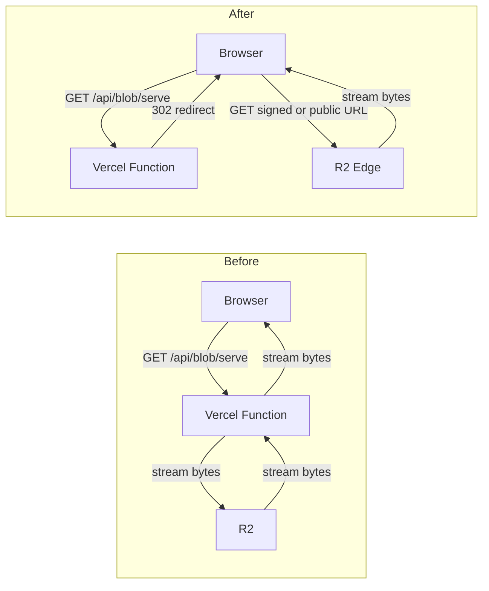

# R2 Full Migration

> Runbook for the 2026-06-01 cutover from Vercel Blob → Cloudflare R2.
> Captures the goal, code touch-points, migration script, verification
> SQL, and rip-out checklist so the rollout has a checked-in record.

## Goal

Every PDF byte flows browser ↔ R2 directly. Vercel only serves HTML,
JSON, and tiny 302 redirects. Fast Origin Transfer drops to ~zero for
storage traffic.



## Strategy in one paragraph

Public textbooks (`public/<slug>/...`) get served straight from R2 via
the bucket's free `r2.dev` public URL stored in `R2_PUBLIC_BASE_URL`.
Private user uploads (`<userId>/<id>.pdf`) keep their access check at
`/api/blob/serve`, but instead of streaming bytes the route now
**302-redirects to a short-lived presigned GET URL**. Service worker
matches the `r2.dev` host as well as the endpoint host. The Vercel Blob
SDK and `BLOB_READ_WRITE_TOKEN` were removed once the migration script
finished and the DB had zero `blob.vercel-storage.com` URLs left.

## Cloudflare-side prep (manual, in the dashboard)

1. R2 → bucket `bowl-beacon-pdfs` → **Settings → Public access** →
   enable **r2.dev subdomain**. Copy the `https://pub-<hash>.r2.dev`
   URL.
2. R2 → bucket → **Settings → CORS Policy** → confirm GET + HEAD with
   `Range` header allow-listed for production origin
   (`https://idk-ju9h.vercel.app` and `http://localhost:3000`). The
   PUT-only CORS for uploads is preserved.
3. (Optional, later) Attach a custom domain — replaces
   `R2_PUBLIC_BASE_URL` value, no code change.

Until step 1 is complete, `/api/blob/serve` falls back to its legacy
byte-proxy for public-key reads, so the deploy can ship before the
dashboard toggle is flipped.

## Code changes

### 1. Storage adapter — `r2PresignedGetUrl` + `publicR2UrlFor`

[lib/storage-backend.ts](../lib/storage-backend.ts) gained two helpers:

- `r2PresignedGetUrl(key, opts)` — signs a 1-h `GetObjectCommand`. Used
  by `/api/blob/serve` for private keys.
- `publicR2UrlFor(key)` — returns `${R2_PUBLIC_BASE_URL}/${key}` if the
  env var is set, else `null` (signals fall-back).

### 2. Read path — `/api/blob/serve` becomes a redirector

[app/api/blob/serve/route.ts](../app/api/blob/serve/route.ts):

- **R2 + key under `public/`** → 302 to `publicR2UrlFor(key)` with
  `Cache-Control: public, max-age=300`.
- **R2 + private key (`<userId>/`)** → 302 to `r2PresignedGetUrl(key)`
  with `Cache-Control: private, no-store` so the redirect can't outlive
  the credential.
- **Public key but `R2_PUBLIC_BASE_URL` unset** → falls back to the
  byte-proxy via `fetchPdf()` (transparent migration window).
- **HEAD**: same dispatch, mirrored.

### 3. Client URL helper — direct URL for public R2

[lib/pdf-client-url.ts](../lib/pdf-client-url.ts) — when the URL already
starts with `NEXT_PUBLIC_R2_PUBLIC_BASE_URL`, returns it unchanged so
the browser fetches direct from R2 with no Vercel hop. Otherwise routes
through `/api/blob/serve` (which now 302s) or `/api/proxy/pdf` for
external sources.

### 4. Service worker

[public/sw.js](../public/sw.js) — bumped to `v6`. Cache-first matchers
now cover both `*.r2.cloudflarestorage.com` (endpoint URLs from the
storage adapter) and `*.r2.dev` (post-cutover direct loads from
`NEXT_PUBLIC_R2_PUBLIC_BASE_URL`).

### 5. Env vars

```
STORAGE_BACKEND=r2
R2_PUBLIC_BASE_URL=https://pub-<hash>.r2.dev
NEXT_PUBLIC_R2_PUBLIC_BASE_URL=https://pub-<hash>.r2.dev
```

`BLOB_READ_WRITE_TOKEN` was removed from `.env.local` and Vercel envs
during rip-out. `STORAGE_BACKEND` is kept as the single value `"r2"`
for forward-compatibility.

[.env.example](../.env.example) reflects the live config.

## Migration of existing data

The migration script copied every Vercel Blob PDF into R2 and rewrote
`documents.file_url`, `textbook_catalog.cached_blob_url`, and
`textbook_catalog.source_url`. Pre-cutover state had:

- 7 public textbooks already in R2 (`textbook_catalog.source_url`).
- 1 user upload already in R2 (`documents.file_url`).
- 4 user-upload `documents` rows with `file_url` pointing at
  `*.private.blob.vercel-storage.com` URLs that **no longer existed in
  Vercel Blob** (the bytes had been pruned earlier; the rows were
  dangling references that already showed up as "Failed to load PDF" in
  the affected users' drives). These rows were deleted directly.

After cleanup, the verification SQL returned 0 across all three
columns. The `migrate-vercel-blob-to-r2.mjs` script and other VB
helpers were then deleted as part of rip-out.

## Verification SQL

```sql
SELECT 'documents.file_url'                AS col, count(*) FROM documents        WHERE file_url        LIKE '%blob.vercel-storage.com%'
UNION ALL
SELECT 'textbook_catalog.cached_blob_url', count(*) FROM textbook_catalog WHERE cached_blob_url LIKE '%blob.vercel-storage.com%'
UNION ALL
SELECT 'textbook_catalog.source_url',      count(*) FROM textbook_catalog WHERE source_url      LIKE '%blob.vercel-storage.com%';
```

All counts must be 0 before the rip-out step. They were.

## Rip-out (completed 2026-06-01)

1. [lib/storage-backend.ts](../lib/storage-backend.ts) — Vercel Blob
   branch removed in every function. `isVercelBlobUrl()` kept as a
   defensive stub returning `false` so any caller that wasn't updated
   still type-checks (no runtime effect — no URLs in the system match).
2. `npm uninstall @vercel/blob`.
3. Deleted routes:
   - `app/api/blob/upload/route.ts` (VB `handleUpload` callback)
   - `app/api/blob/multipart/route.ts` (VB-specific multipart)
   - `app/api/blob/token/route.ts` (legacy VB token issuer)
   - `app/api/admin/blob-token/route.ts`
   - `app/api/admin/blob-client-token/route.ts`
   - `app/api/admin/blob-write-token/route.ts`
   - `app/api/admin/blob-lookup/route.ts`
4. `app/api/blob/client-token/route.ts` — VB branch removed; R2-only.
5. `lib/upload-client.ts` — VB branch removed; R2-only.
6. `app/api/admin/archive-upload/route.ts` — `del` from `@vercel/blob`
   replaced with `deletePdf()` from the storage adapter.
7. `app/api/blob/health/route.ts` — env-check now reports R2 vars.
8. `app/api/proxy/pdf/route.ts` — `blob.vercel-storage.com` removed
   from the host allowlist.
9. `lib/pdf-client-url.ts`, `app/study/session/page.tsx`,
   `app/admin/page.tsx`, `public/sw.js` — VB host detection / type
   union narrowed to R2-only.
10. Removed `BLOB_READ_WRITE_TOKEN` from `.env.local` and Vercel envs.
11. Deleted `scripts/migrate-vercel-blob-to-r2.mjs` and
    `scripts/migrate-blobs-public.mjs` (one-shots, fully consumed).
12. Updated [docs/ARCHITECTURE.md](ARCHITECTURE.md) §2 storage line, §3
    file map, §5 routes table, §5.11 heading, §7 admin storage tab, §7
    service worker note, §8 security, §9 scripts, §10 env vars.

## Quick correctness check

- **Uploads** — `lib/upload-client.ts` routes to `/api/blob/r2-multipart`
  for files > 50 MB and to a presigned PUT for everything else. Direct
  browser → R2 multipart PUTs. No Vercel egress for upload bytes.
- **Public textbook view** — client gets
  `https://pub-….r2.dev/public/...` from `pdfClientLoadUrl()` and
  fetches it. No Vercel hop.
- **Private user PDF view** — client hits `/api/blob/serve?url=…`,
  gets a 302 to a signed R2 URL, browser fetches direct. Only the
  redirect (~200 bytes) goes through Vercel.
- **Downloads** — same as view (`<a href={pdfClientLoadUrl(...)}
  download>` or the same redirect pathway).

## Risks and mitigations

- **r2.dev rate limits** — Cloudflare throttles obvious production
  traffic on r2.dev. Mitigation: monitor R2 dashboard; if throttled,
  attach a custom domain (one env var change).
- **Signed URL expiry inside SW cache** — fixed by
  `Cache-Control: no-store` on the redirect; the SW caches the R2
  bytes themselves which are content-addressed.
- **Stale Vercel Blob URLs in DB after rip-out** — guard rail: the
  rip-out step was gated on the SQL count=0 check above.
